# Abstract

This thesis focuses on the development and study of a program where two agents play soccer in a deterministic environment. The agents are opponents and use reinforcement learning algorithms for decision-making, specifically the Q-Learning, Minimax-Q, and Belief-Q algorithms. The objective of the work is to evaluate the effectiveness of various reinforcement learning algorithms in a competitive environment where the agents have opposing goals. The methodology involves developing a simulated soccer environment where agents learn to play soccer by interacting with the environment and the opponent. The Q- Learning algorithm was used as the primary learning algorithm, while Minimax-Q and Belief-Q were introduced to study agent performance in more complex decisionmaking scenarios that require predicting the opponent's moves. The main steps taken include the initial implementation of the algorithms, adapting them to the soccer environment, and conducting experiments to evaluate the strategies developed. The results showed that each algorithm has different strengths and weaknesses depending on the opponent's strategy.

# 1. Introduction

Reinforcement Learning (RL) has emerged as one of the most dynamic fields in artificial intelligence, offering tools for solving complex decision-making problems. In this study, three reinforcement learning algorithms—Q-Learning, Minimax-Q, and Belief-Q—are examined within a competitive soccer game environment. The agents, who are opponents, make decisions in a deterministic environment with the aim of achieving opposing goals. Markov Decision Processes (MDPs) form the foundation for modeling decision-making in environments where outcomes depend both on the actions of the agent and on randomness due to the agent's willingness to explore the environment. These processes include states, actions, transition functions between states, and reward functions, allowing agents to learn the best strategy (policy) to maximize their performance. The Q-Learning algorithm is widely known for its ability to learn the optimal policy through iterative updates of Q-values, which correspond to the estimated utility of taking specific actions in given states. On the other hand, the Minimax-Q and BeliefQ algorithms introduce more advanced techniques that take into account possible strategies of the opponent, either by finding the optimal strategy under conditions of complete opposition (Minimax-Q) or by using probabilities for the opponent's actions (Belief-Q). This research focuses on evaluating the performance of these algorithms in a complex environment with a large number of states. To address the complexity of the environment, it is proposed to divide it into two smaller sub-environments, where the algorithms are trained separately. The study then evaluates the algorithms' performance in both the smaller environments and the original larger environment, analyzing the strategies developed and the results obtained from their comparison. The structure of the thesis is as follows: The first section provides a general overview of MDPs and their role in reinforcement learning. The second section analyzes the QLearning, Minimax-Q, and Belief-Q algorithms, along with their implementation methods. The third section describes the specific environment and the complexity issue it presents. In the following sections, the approach to dividing the environment, the training of the algorithms, the results of their comparison, and, finally, the evaluation of their performance in the original, larger environment are presented.

# 2. Theoretical Background And Reinforcement Learning Algorithms

## 2.1 Markov Decision Processes (Mdps)

A Markov Decision Process (MDP), also known as "stochastic dynamic programming" or a "stochastic control problem," is a model for sequential decision-making where outcomes are uncertain. [1] The term "Markov Decision Process" comes from its connection to Markov chains, a mathematical concept developed by Russian mathematician Andrey Markov. A Markov chain is a sequence of states where the probability of transitioning to the next state depends only on the current state, not on the sequence of events that preceded it. This property is known as the Markov property or memorylessness. [2]

### Markov Decision Process (MDP)

A Markov Decision Process is defined as a tuple $`(S, A, P_a, R_a)`$ where:

- $`S`$ is a set of states called the state space. The state space can be discrete or continuous, such as the set of real numbers.
- $`A`$ is a set of actions called the action space (alternatively $`A_s`$ is the set of actions available from state $`s`$).
- $`P_a(s, s')`$ is the probability that action $`a`$ in state $`s`$ at time $`t`$ will lead to state $`s'`$ at time $`t+1`$.
- $`R_a(s, s')`$ is the immediate reward (or expected immediate reward) received after transitioning from state $`s`$ to state $`s'`$ due to action $`a`$.

Additionally, there is at least one initial state $`S_0`$ and possibly a terminal state $`S_{Goal}`$.

The objective in a Markov Decision Process is to find a good "policy" for the decision-maker, meaning a function $`\pi`$ that specifies the action $`\pi(s)`$ to be taken when in state $`s`$. Once an MDP is paired with a policy in this way, the resulting state-action combinations behave like a Markov chain, as the action chosen in state $`s`$ is entirely determined by $`\pi(s)`$, assuming the policy is deterministic [2].

To manage randomness, we maximize the expected sum of rewards. Generally [3]:

$`\pi^* = \arg\max_{\pi} \mathbb{E} \left[ \sum_{t \geq 0} \gamma^t r_t \mid s_0 \sim p(s_0), a_t \sim \pi(\cdot \mid s_t), s_{t+1} \sim p(\cdot \mid s_t, a_t) \right]`$

Where:

- $`\pi^*`$: The optimal policy that maximizes the expected total reward.
- $`\gamma^t`$: The discount factor raised to the power of $`t`$, with $`0 \leq \gamma \leq 1`$. It determines the present value of future rewards. A lower $`\gamma`$ makes future rewards less important.
- $`r_t`$: The reward received at time step $`t`$.
- $`\mid \pi`$: Given policy $`\pi`$, it shows that the expectation is conditional on the sequence of policy $`\pi`$.
- $s_0 \sim p(s_0)$: The initial state $s_0$ which follows the distribution $p(s_0)$.
- $a_t \sim \pi(\cdot \mid s_t)$: The action $a_t$ at time $t$, determined by the policy $\pi$ given the current state $s_t$.
- $s_{t+1} \sim p(\cdot \mid s_t, a_t)$: The next state $s_{t+1}$ which is drawn from the transition probability distribution $p(\cdot \mid s_t, a_t)$, which depends on the current state $s_t$ and action $a_t$.

To solve MDPs, we use variations of the Bellman equation. Specifically, through the Bellman equation, we can:

1. **Compute optimal state values** using the value iteration method, where the Bellman equation characterizes the optimal values [3]:

   
   $`V^*(s) = \max_a \sum_{s'} T(s, a, s') \left[ R(s, a, s') + \gamma V^*(s') \right]`$
   

   Where:

   - $V^*(s)$: The optimal value of state $s$, i.e., the maximum expected total reward that can be obtained from state $s$.
   - $T(s,a,s')$: The probability of transitioning from state $s$ to state $s'$ when action $a$ is taken.
   - $R(s,a,s')$: The reward received when action $a$ is taken in state $s$ and the transition to state $s'$ occurs.
   - $\gamma$: The discount factor, determining the present value of future rewards.
   - $V^*(s')$: The optimal value of the next state $s'$.

   Value iteration computes these values iteratively:

   
   $`V_{k+1}(s) \leftarrow \max_a \sum_{s'} T(s, a, s') \left[ R(s, a, s') + \gamma V_k(s') \right]`$
   

2. **Compute optimal state values via policy iteration**, where the Bellman equation is used to evaluate both the states and the $i$-th policy [3]:

   
   $`V_{k+1}^{\pi_i}(s) = \sum_{s'} T(s, \pi_i(s), s') \left[ R(s, \pi_i(s), s') + \gamma V_k^{\pi_i}(s') \right]`$
   

   Where:

   - $V_k^{\pi_i}(s)$: The estimated value of state $s$ at the $k$-th iteration under policy $\pi_i$.
   - $T(s,\pi_i(s),s')$: This is the probability of transitioning from state $s$ to state $s'$ when following the action proposed by policy $\pi_i$ in state $s$.
   - $R(s,\pi_i(s),s')$: This is the reward received when the action chosen by policy $\pi_i$ in state $s$ leads to state $s'$.
   - $V_k^{\pi_i}(s')$: This represents the estimated value of state $s'$ at the $k$-th iteration of policy evaluation under policy $\pi_i$.

   This equation allows us to estimate how good the policy $`\pi_i`$ is in each state $`s`$. We then use the results of this evaluation to improve the policy with the following equation:

   $`\pi_{i+1}(s) = \arg\max_a \sum_{s'} T(s, a, s') \left[ R(s, a, s') + \gamma V^{\pi_i}(s') \right]`$

   Where:

   - $`\pi_{i+1}(s)`$: This is the updated policy for state $`s`$, which results from optimizing the expected total reward based on the current value function estimates.
   - $`V^{\pi_i}(s')`$: This is the value of the next state $`s'`$ under policy $`\pi_i`$, obtained from the previous iterative update.

   Using this equation, we choose the best action for each state, updating the policy from $`\pi_i`$ to $`\pi_{i+1}`$.

### How good is a state?

The value function for state $`s`$ is the expected cumulative reward from following the policy starting from state $`s`$ [3]:

$`V^{\pi}(s) = \mathbb{E} \left[ \sum_{t \geq 0} \gamma^t r_t \mid s_0 = s, \pi \right]`$

Where:

- $`V^{\pi}(s)`$: The value function for state $`s`$ under policy $`\pi`$, representing the expected total reward starting from state $`s`$ and following policy $`\pi`$.
- $`s_0`$: The initial state, which is equal to state $`s`$, indicating that the expected total reward starts from state $`s`$.
- $`\pi`$: The policy, i.e., the rule that determines which action will be executed in each state.

### How good is a state-action pair?

The Q-value function for state $`s`$ and action $`a`$ is the expected cumulative reward from taking action $`a`$ in state $`s`$ and then following the policy [3]:

$`Q^{\pi}(s, a) = \mathbb{E} \left[ \sum_{t \geq 0} \gamma^t r_t \mid s_0 = s, a_0 = a, \pi \right]`$

Where:

- $`Q^{\pi}(s, a)`$: The action-value function for state $`s`$ and action $`a`$ under policy $`\pi`$. It represents the expected total reward starting from state $`s`$, taking action $`a`$, and then following policy $`\pi`$.
- $`a_0`$: The initial action, which is equal to action $`a`$, indicating that the policy starts by taking action $`a`$ from state $`s`$.

Having mentioned the term of state-action pairs, we can extend and further analyze the first of the implemented reinforcement learning algorithms, the Q - Learning algorithm.

### 2.2 Q-Learning

The Q-Learning algorithm is based on the concept of the Q-value, which expresses the quality of an action when executed in a particular state. The Q-value of a state-action pair is denoted as $`Q(s, a)`$, representing the expected cumulative reward that the agent will receive if it takes action $`a`$ in state $`s`$ and then follows the optimal policy.

The agent starts with a Q-value table where all Q-values are typically initialized to zero or some small random number. This table is updated gradually as the agent explores the environment.

At each step, the agent finds itself in a specific state $`s`$ and must select an action $`a`$. To choose the action, the algorithm uses an exploration-exploitation strategy, such as epsilon-greedy. The agent sometimes selects the action with the highest Q-value (exploitation) and other times selects a random action to explore new possibilities (exploration).

After executing action $`a`$ in state $`s`$, the agent transitions to a new state $`s'`$ and receives a reward $`r`$.

It then updates the Q-value for the state-action pair $`(s, a)`$ using the following formula [4] [5]:

$`
Q(s, a) \leftarrow (1 - \alpha) Q(s, a) + \alpha \left[ r(s, a, s') + \gamma \max_{a'} Q(s', a') \right]
`$

Where:

- $`\alpha`$ is the learning rate, which determines how quickly the Q-value is adjusted.
- $`r(s, a, s')`$ is the immediate reward received in state $`s`$ after performing action $`a`$ to transition to state $`s'`$.
- $`\max_{a'} Q(s', a')`$ is the maximum expected future reward from the next state $`s'`$.

The agent repeats this process for many episodes, continuously updating the Q-value table as it learns the optimal actions for each state. The goal is to learn the optimal policy, i.e., the strategy that selects the actions with the highest Q-values in each state, thereby maximizing long-term rewards.

### 2.3 Minimax-Q

The Minimax-Q algorithm is an extension of the classical Q-Learning, designed for environments where competition exists between two or more agents with conflicting interests. The main objective of Minimax-Q is to compute the optimal policy for an agent, considering that the opposing agent will choose actions that minimize the first agent's gains.

The algorithm is based on zero-sum game theory, where the gains of one agent are exactly the losses of the other. Although the environment described here is a non-zero-sum game, Minimax-Q can still be applied since the agents are opponents. To find the optimal strategy, the agent solves a linear programming problem that maximizes the minimum reward it can receive, taking the opponent's actions into account.

#### Initialization:

For all states $`s`$ in the set of states $`S`$, for all actions $`a`$ in the set of actions $`A`$, and for all opponent actions $`o`$ in the set of possible opponent actions $`O`$ [6]:

$`
Q[s, a, o] := 1
`$

For all states $`s`$ in the state set $`S`$:

$`
V[s] := 1
`$

For all states $`s`$ in the set of states $`S`$ and for all actions $`a`$ in the set of actions $`A`$:

$`
\pi[s, a] := \frac{1}{|A|}
`$

(At the beginning, the probability of selecting each action is equal for all actions.)

Learning rate $\alpha$ initialization:

$`
\alpha := 1.0
`$

#### Action Selection in State $`s`$:

- With probability $`explor`$, the agent selects an action randomly from the set of possible actions (exploration).
- Otherwise, the agent selects the action $`a`$ with probability $`\pi[s, a]`$ (exploitation). In this implementation, to maintain the deterministic nature of the environment, action $`a`$ is chosen with probability $`1.0`$, and it corresponds to the action with the highest probability according to the distribution $`\pi[s, \cdot]`$.

In this implementation, to maintain the deterministic nature of the environment, action a is chosen with probability 1.0, and it corresponds to the action with the highest probability according to the distribution π[s, ⋅].

#### Learning:

After the agent receives a reward $`r(s,a,o,s')`$ for transitioning from state $`s`$ to state $`s'`$ via action $`a`$ and the opponent's action $`o`$, the Q-value is updated [6]:

$`
Q[s, a, o] := (1 - \alpha) \cdot Q[s, a, o] + \alpha \cdot \left( r(s, a, o, s') + \gamma \cdot V[s'] \right)
`$

Where:

- $`Q[s,a,o]`$: is the action-value function for state $`s`$, action $`a`$, and the opponent's response $`o`$. It evaluates how good it is to take action $`a`$ in state $`s`$, considering the opponent's response.
- $`r(s, a, o, s')`$: is the immediate reward received for transitioning from state $`s`$ to state $`s'`$ by performing action $`a`$ and the opponent's response $`o`$.
- $`V[s']`$: is the value function for the next state $`s'`$, representing the expected total reward from state $`s'`$ onward.

#### Finding the Optimal Policy through Linear Programming:

The agent uses linear programming to find the policy $`\pi[s, \cdot]`$ that maximizes the minimum possible Q-value, considering all possible opponent actions [6]:

$`
\pi[s, \cdot] := \arg \max_{\pi[s, \cdot]} \min_{o'} \left\{ \sum_{a'} \pi[s, a'] \cdot Q[s, a', o'] \right\}
`$

Where:

- $`\pi[s, \cdot]`$: is the policy for state $`s`$. The policy $`\pi`$ defines the probability of executing each action in state $`s`$.
- $`\pi[s,a']`$: is the probability of executing action $`a'`$ from state $`s`$ under policy $`\pi`$.

Here, $`\arg \max_{\pi[s, \cdot]}`$ selects the policy $`\pi[s, \cdot]`$ that maximizes the expression. The updated policy $`\pi`$ must maximize the minimum expected benefit, considering the probabilities of various actions. The $`\min_{o'}`$ operator chooses the least favorable opponent action $`o'`$ (i.e., the worst-case scenario for the agent).

This process ensures that the agent chooses a policy that is as safe as possible against the worst possible actions from the opponent.

#### Updating the Value $`V`$ [6]:

$`
V[s] := \min_{o'} \left( \sum_{a'} \pi[s, a'] \cdot Q[s, a', o'] \right)
`$

Where:

- $`\pi[s,a']`$: is the probability of executing action $`a'`$ from state $`s`$ under policy $`\pi`$.

Here, the $`\min_{o'}`$ operator selects the minimum value of the expression that follows, taking into account all possible responses $`o'o'`$ from the opponent. This minimization ensures that the agent prepares for the worst possible outcome from the opponent.

This minimization represents the choice of the worst-case scenario (i.e., the least favorable action of the opponent for the Minimax-Q agent).

#### Updating the Learning Rate:

$`
\alpha := \alpha \cdot decay
`$

While Q-Learning computes the policy based on the expected reward in a static environment, Minimax-Q computes the policy by considering the opponent’s potential actions that would cause the most harm. This makes Minimax-Q more suitable for competitive environments where there is a direct conflict of interests between agents.

Minimax-Q requires solving linear programming problems to compute the policy in each state. This is essential to ensure that the agent’s policy is resilient against the possible harmful actions of the opponent. In contrast, Q-Learning simply selects the action with the highest Q-value without considering the opponent’s strategy.

### 2.4 Belief-Q

The **Belief-Q** algorithm is a variation of Q-Learning, adapted for environments where agents must account for uncertainty regarding the strategies or actions of their opponents. This algorithm allows the agent to form **beliefs** about the possible actions of their opponents and update those beliefs as new information is received.

**Belief-Q** aims to optimize the agent’s strategy based on the potential reactions of opponents by combining Q-values with the probabilities that opponents will choose certain actions.

As in classical Q-Learning, we initialize a Q-value table for all states $`s`$ and actions $`a`$. Simultaneously, we initialize the beliefs regarding the actions of the opponent. Specifically, at the start, for each state and action of the agent, we create a probability table that represents our beliefs about which actions the opponent might choose. Initially, these beliefs are set to equal values, indicating no preference for any of the opponent's actions (i.e., all opponent actions are considered equally probable). As the agent interacts with the environment, these beliefs are updated based on observations of the opponent's actions, adjusting the probabilities of different opponent actions. Specifically, after each learning step, the probability of each opponent action in the belief table is updated to incorporate the new information.

The agent selects an action $`a`$ based on the policy derived from the updated Q-values and the beliefs about the opponent’s actions. For each possible action, the agent consults the Q-value table (Q-table) to find the corresponding Q-value. This value depends on the agent’s beliefs about the opponent’s possible actions. These beliefs determine the probability that the opponent will choose a particular action.
The agent multiplies the Q-value for each combination of its own action and the opponent's action by the probability corresponding to the opponent's action, as expressed by the agent's beliefs. The result is a weighted sum of Q-values, where each Q-value for an opponent's action is weighted by the probability that the agent believes the opponent will choose that action. This process produces an overall expected value for the agent’s action, taking into account the different opponent responses and their probabilities. The agent then selects the action that maximizes this expected value, attempting to find the best possible strategy based on its beliefs about the opponent’s actions.

After the agent receives a reward $`r(s_t, a_t)`$ for transitioning from state $`s_t`$ to state $`s_{t+1}`$ by executing action $`a`$, the Q-value is updated [7]:

$`
Q_{t+1}(s_t, a_t) \leftarrow (1 - \alpha) Q_t(s_t, a_t) + \alpha \left[ r(s_t, a_t, s_{t+1}) + \gamma V_t(s_{t+1}) \right]
`$

Where:

- $`Q_{t+1}(s_t, a_t)`$: is the updated action-value function Q for state $`s_t`$ and action $`a_t`$ at time step $`t+1`$.

#### Updating the Value Function $`V`$ Based on Beliefs [7]:

$`
V_t(s) \leftarrow \max_{a_i} \left[ \sum_{a_{-i} \subseteq A_{-i}} Q_t(s, (a_i, a_{-i})) \cdot Pr_i(a_{-i}) \right]
`$

Where:

- $`a_i`$: represents the agent’s action.
- $`a_{-i}`$: represents the opponent’s actions.
- $`Pr_i(a_{-i})`$: is the agent’s belief about the probability that the opponent will choose action $`a_{-i}`$.
- $`Q_t(s, (a_i, a_{-i}))`$: is the action-value function (Q-value) for state $`s`$ at time $`t`$, when agent $`i`$ selects action $`a_i`$ and the opponent selects action $`a_{-i}`$.

# 3. Design Of The Environment And Handling State Complexity

3.1 **Description of the Environment**

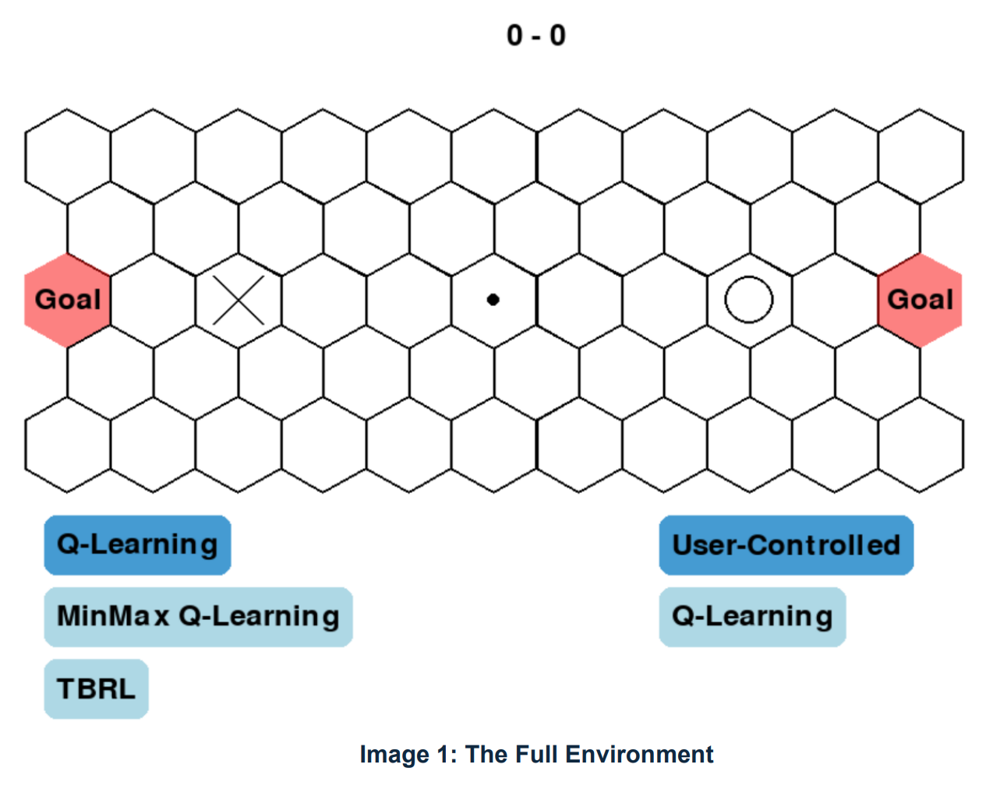

The **Full Environment (FE)**, or complete environment (Image 1), consists of a hexagonal grid where each cell represents a possible position for an agent or the ball. Each agent tries to score a goal in the opponent’s goal. The goals are located at the two ends of the grid, to the left and right, marked with red hexagons. The agent located on the right side, represented by a circle, will be referred to as "Player" from this point on (since the user can control its movements), while the agent on the left will be called "Agent." Neither the player nor the agent can move into the goal cells. No entity (Player, Agent, or ball) can occupy or move into a cell already occupied by another entity. This is a variation of the environment described in [4].

No entity can move outside the grid. If the ball reaches the left goal, one point is added to the score on the right side (as it is considered a point for the Player). Similarly, if the ball reaches the right goal, a point is added to the left side of the score. If the ball enters a goal or a corner, the environment resets to its initial state (Image 1). The Player takes the first move at the start of the simulation, while after each reset, the first move is given to the one who did *not* make the last move before the reset (i.e., the one who conceded the goal or did not cause the ball to go to a corner). The buttons below the grid define the logic for selecting the corresponding agent’s movement.

The movements of an agent depend on its current state. For example, if an agent is far from the ball and far from the boundaries of the grid, the available movements include six possible directions (light blue cells).

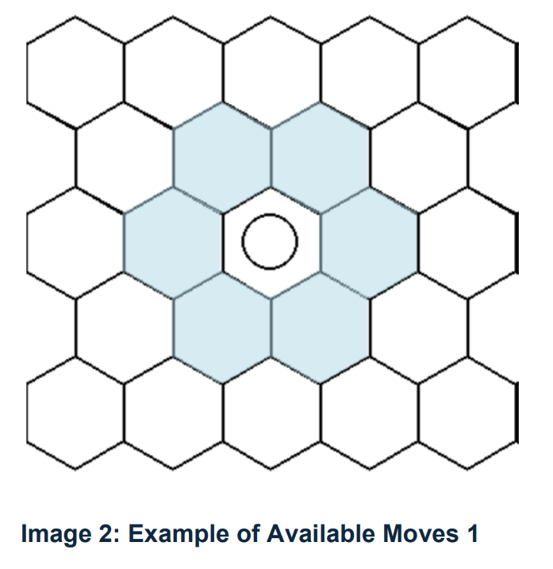

Available actions are:
- Move_up_left
- Move_up_right
- Move_left
- Move_right
- Move_down_left
- Move_down_right

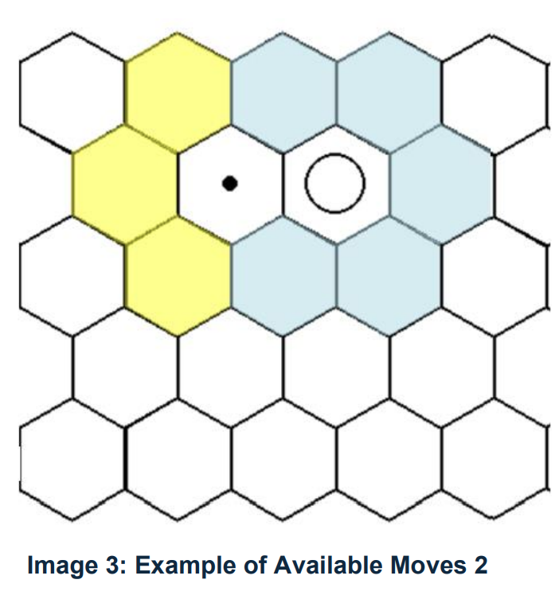

In case an agent is close to the ball and away from the grid boundaries, the available actions are three kick actions (yellow cells) and five move actions (blue cells)

Available actions are:
- Move_up_left
- Move_up_right
- Move_right
- Move_down_left
- Move_down_right
- Kick_up_left
- Kick_left
- Kick_down_left

And they change depending on the angle of the agent and the ball accordingly.

Of course, each agent does not have the ability to kick the ball or move to a position outside the boundaries of the grid:

Available actions are:
- Move_up_left
- Move_up_right
- Move_right
- Kick_up_left
- Kick_left

Furthermore, any of the two agents cannot be in the same cell as their opponent, or the ball.

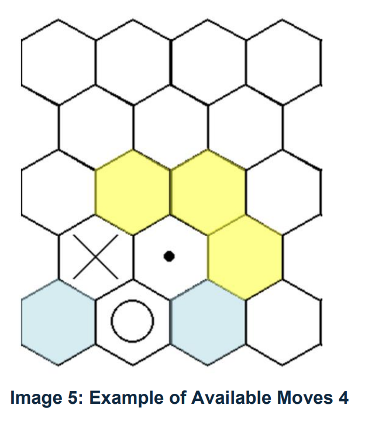

Available actions are:
- Move_left
- Move_right
- Kick_up_left
- Kick_up_right
- Kick_right

3.1 **The Large State Space Problem**

For the reinforcement learning algorithms discussed in the previous chapter to function correctly, a complete representation of the environment is necessary. In the environment we are dealing with, a complete representation includes the exact location of the ball, one agent, and their opponent.

There are a total of 53 cells in the grid. Agents cannot occupy goal cells. All entities are always positioned in different cells. Therefore, we have 49 available positions for each agent and 51 available positions for the ball. The total number of possible states is:

$`
49_{Agent\ Positions} \cdot 49_{Player\ Positions} \cdot 51_{Ball\ Positions} = 122,451\ states
`$

A simple solution to address the large state space problem is to reduce the number of states by changing the environment’s representation. For instance, if we design algorithms that do not necessarily require the position of the opponent to function correctly, we can omit the opponent in each agent's implementation. In this case, the number of states would be reduced to:

$`
49_{Agent\ or\ Player\ Positions} \cdot 51_{Ball\ Positions} = 2,499\ states
`$

An implementation of **Q-Learning** based on this approach has been developed for the Agent and is presented in the full environment in section 4.3.1. **Q-Learning** can function without problems in an environment where the agent observes only itself and the ball, as long as it receives rewards based only on its own actions and not those of the opponent. However, both **Minimax-Q** and **Belief-Q** require observing the opponent, as they develop strategies based on the opponent’s movements. Therefore, a solution to the large state space problem is necessary for the correct implementation of these algorithms.

3.1 **The Solution to the Large State Space Problem**

One way to reduce the number of states is to limit the vision of an agent. In our environment, we can achieve a similar result by dividing the environment into smaller sub-environments and training the agent separately within these smaller environments. Specifically:

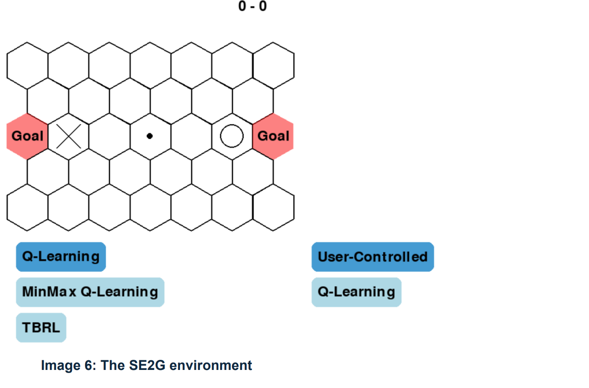

We define the **SE2G (Small Environment with 2 Goals)** in order to significantly reduce the state space. With a full representation of this smaller environment, we have:

$`
29_{Agent\ Positions} \cdot 29_{Player\ Positions} \cdot 31_{Ball\ Positions} = 26,071\ states
`$

A reduction of **79%** compared to the full environment (FE) is achieved with the SE2G environment. Due to the smaller number of states, the successful training of agents is now feasible. However, this does not mean that the training is entirely accurate. For instance, if we train the Agent in this smaller environment and then apply the learned policy to the full environment (Full Environment, FE), we significantly limit the algorithm's capabilities, as the movements being used may not be representative of the full environment. For example:

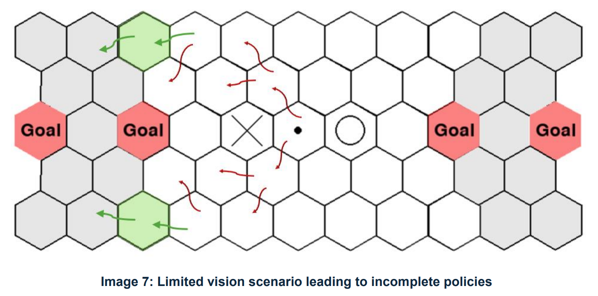

In the scenario shown in Image 7, the Player uses a policy discovered during training in the SE2G environment. The paths the Player has learned are represented by red arrows. We observe that, because the Player was trained in an environment where the opponent's goal is close, the policies it has found do not represent the true optimal policies it would have discovered (green arrows) if it had been trained in the full environment. This is because the policy does not include the green cells in its possible paths—these cells can and should be used to bypass the opponent. In the SE2G environment, these cells represent corners and are thus not included in the Player’s potential paths.

However, in other scenarios, the policies the agent discovers during training in SE2G do match the representative moves it would have found during training in the full environment (FE).

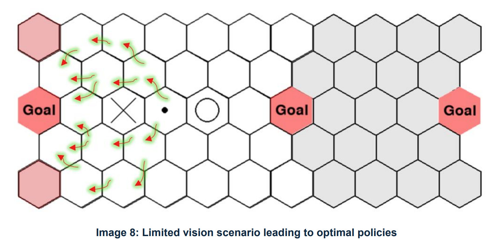

In the scenario depicted in Image 8, although the agent was trained in a smaller environment, it finds itself in a position where the policies it has discovered are not limited in any way. As a result, it follows the same moves it would have made if the training had occurred in the full environment. The corners it avoids (red cells) represent the actual corners of the environment and are not cells that are crucial for finding the optimal policy. Therefore, we can use the training from the SE2G environment in the green areas below, as the policy discovery is not restricted in any way.

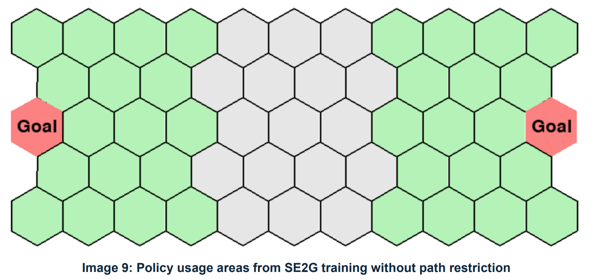

Thus, areas near the goals are regions where the agents have developed complete strategies, meaning that the movements in these areas can be derived from the SE2G environment implementation.

To create an implementation suitable for the center of the environment, we need to modify the corners from cells of negative rewards to cells with positive rewards. This leads to the creation of the **SE6G (Small Environment with 6 Goals)**:

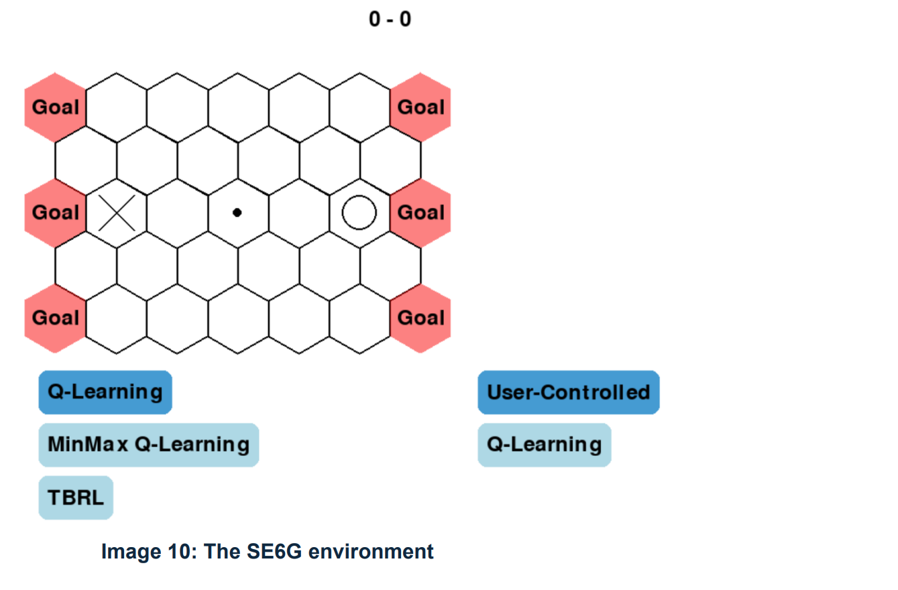

The **SE6G environment** is specifically designed to address the shortcomings of SE2G and will be used to discover the policies in the center of the environment. It shifts focus away from simply scoring goals and instead emphasizes bypassing the opponent.

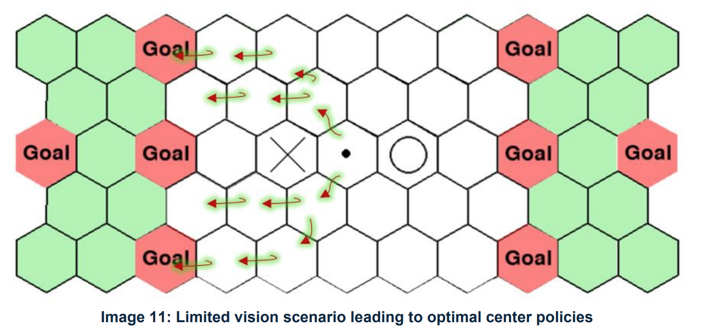

In the scenario depicted in Image 11, both the **Agent** and the **Player** are trained in movements where the goal is not necessarily to score or defend a goal, but rather to successfully or unsuccessfully bypass the opponent. The corners of the SE6G environment act as cells with positive rewards, encouraging the creation of paths that better represent the complete paths the Player would discover if trained in the full environment (FE). At the same time, the defensive movements of the Agent aim to block the Player from advancing the ball across the grid, ensuring that all areas of the grid are defended, rather than incorrectly assuming that the corners are unreachable due to low rewards.

By combining the **SE2G** and **SE6G** environments, we can create an environment where agents learn policies that they would have developed if trained in the full environment, solving the problem of the large state space. 

We will apply the training from the SE6G environment in the following green area, allowing for more comprehensive policy learning in the center of the grid.

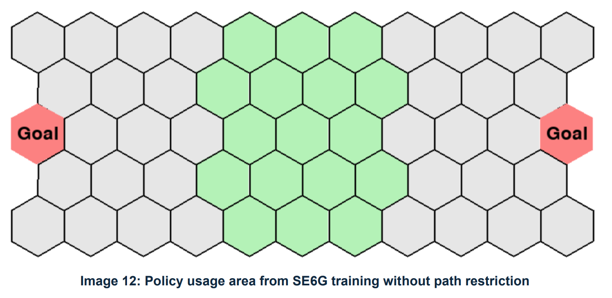

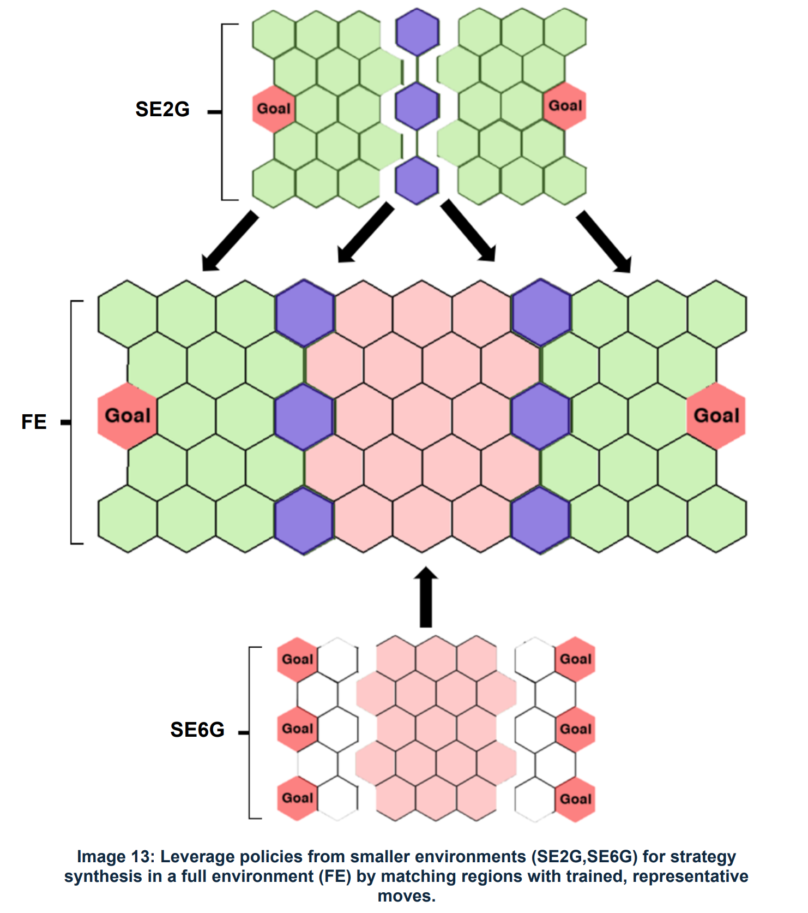

# 4. Training of Algorithms and Evaluation of Results

The training of the three algorithms with a full representation of the environment was conducted in the two smaller environments (SE2G, SE6G). Additionally, there was one instance of training **Q-Learning** in the full environment (FE) where the opponent's position was omitted from the state representation. The rewards were slightly adjusted depending on the environment.

To facilitate the identification of a specific algorithm implementation, the following naming rules are used: Each implementation name follows the pattern: **XXXYYYY ZZZZ**

Where:
- **XXXX** refers to the environment (SE2G, SE6G, FE), and it is optional.
- **YYYY** refers to the algorithm (Q = Q-Learning, MQ = Minimax-Q, BQ = Belief-Q). It can be written out fully if the **XXXX** field is omitted.
- **ZZZZ** refers to the parameters and includes the following options:
  1. **trE** = training Epsilon (the minimum value that epsilon will reach after a certain number of episodes during training. The maximum value is always 1.0).
  2. **exE** = execution Epsilon (the constant epsilon value used during the execution of a trained algorithm. This is not used for describing a training implementation).
- If two parameters are included in the **ZZZZ** field, they are separated by a comma (“,”).
- If multiple environments are used in the **YYYY** field, the above naming conventions are not applied. Instead, specialized rules are used for specific cases.

The experiments conducted in each environment, for each algorithm, only differed based on the trE and exE parameters.

The rationale behind the experiments with varying e values during the training and execution phases of the **Q-Learning**, **Minimax-Q**, and **Belief-Q** algorithms was to explore how randomness affects their performance at each stage. Specifically, two different randomness strategies were used, where e decreased gradually from 1.0 to 0.1 and 0.05 during training. This was done to assess how exploration of the environment impacts the learning process and the final optimization of strategies.

In the execution phase, with the algorithms already trained, constant e values (0.1 and 0.05) were used to evaluate the performance of the strategies under different levels of randomness, without further learning. Through these experiments, the goal was to understand the sensitivity of the algorithms to the randomness parameters and to determine the conditions that lead to optimal performance both during learning and when applying the trained strategies.

# 4.1 The SE2G Environment

4.1.1 **Q-Learning**

The rewards in the SE2G environment for Q-Learning are as follows:

**Agent A receives the following rewards immediately after its actions:**
- -1 if it moved further away from the ball.
- +1 if the distance between the ball and the opponent's goal decreased.
- +100 if it scored a goal in the opponent's goal.
- -100 if it scored a goal in its own goal.
- -10 if it pushed the ball into a corner.
- -5 for any other move.

**Agent A receives the following rewards immediately after Agent B’s actions (for the immediately previous state-action pair that occurred):**
- +100 if Agent B scored a goal in their own goal.
- -100 if Agent B scored a goal in Agent A’s goal.

The Q-Learning algorithm was implemented in the SE2G environment with the following parameters:
- Learning rate = 0.1
- Discount Factor = 0.9
- Epsilon: Linear function with $`e_{max} = 1.0, e_{min} = 0.1, \text{max episodes} = 10,000`$

$`
e_t = \max \left( e_{min}, e_{max} - \frac{e_{max} - e_{min}}{\text{max episodes}} \cdot t \right)
`$

- $`e_t`$ is the value of epsilon at episode $`t`$.
- $`e_{max}`$ is the initial maximum value of epsilon.
- $`e_{min}`$ is the minimum value of epsilon.
- max episodes is the total number of episodes over which epsilon decreases.
- $`t`$ is the current value of the episode.

The epsilon decay continued until **10,000 episodes**, where $`e`$ reached 0.1, but the training continued up to **80,000 episodes**. The training was conducted simultaneously for both agents.

The implementation is named according to the naming conventions as either: “SE2GQ trE=0.1” or “Q – Learning trE=0.1”.

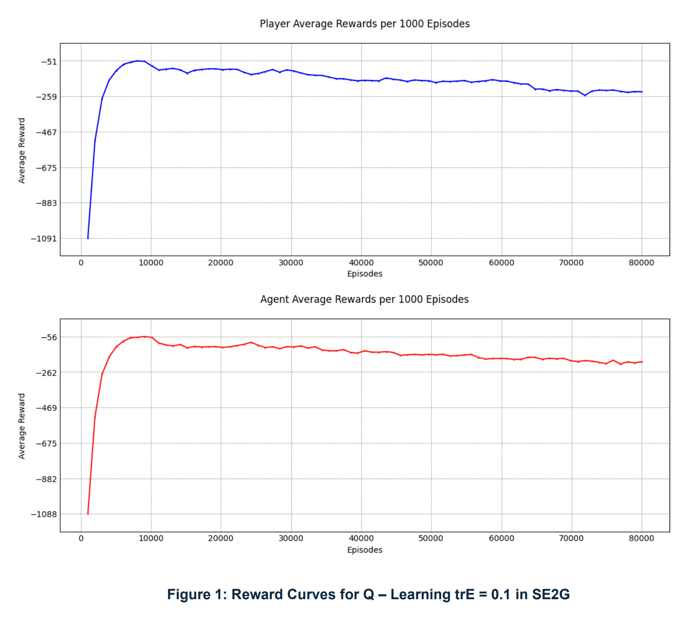

**Figure 1** shows on the y'y axis the average total rewards for the actions in the episodes, averaged over every 1,000 episodes. The actual x'x axis step is 1,000 episodes, but the labels are spaced at 10,000 episodes.

The reward curves are quite similar since they represent implementations of the same algorithm in the same environment with identical parameters. The highest average reward is observed at the point where epsilon reaches its minimum value. This indicates that the agents have already gained a good understanding of their environment. Over the next 70,000 episodes, they continue refining their strategies, making it progressively harder to score a goal, leading to a steady decline in the average reward per episode.

4.1.2 **Minimax – Q**

The rewards in the SE2G environment for **Minimax-Q** are as follows:

**Agent A receives rewards for the transition from state $`s`$ to state $`s'`$:**
- -1 if it moved further away from the ball.
- +1 if the distance between the ball and the opponent's goal decreased.
- +100 if the ball is in the opponent's goal.
- -100 if the ball is in its own goal.
- -10 if the ball was pushed into a corner.
- -5 for any other move.

The difference between **Minimax-Q** and **Q-Learning** lies in the timing of the rewards. In Minimax-Q, the state $`s'`$ is the state after the opponent’s response, meaning the reward is given based on the outcome after the opponent’s action. In contrast, Q-Learning rewards the agent immediately after its own action (or retroactively if the opponent scores).

Two implementations of the **Minimax-Q** algorithm were done in the SE2G environment with the following parameters:
- Discount Factor = 0.9
- Learning Rate: Linear function with $`a_{max} = 0.9, a_{min} = 0.1, \text{max episodes} = 10,000`$

$`
a_t = \max \left( a_{min}, a_{max} - \frac{a_{max} - a_{min}}{\text{max episodes}} \cdot t \right)
`$

- $`a_t`$ is the learning rate at episode $`t`$.
- $`a_{max}`$ is the initial maximum value of $`\alpha`$.
- $`a_{min}`$ is the minimum value of $`\alpha`$.
- max episodes is the total number of episodes over which $`\alpha`$ decreases.
- $`t`$ is the current value of the episode.

- **Epsilon**:
  1. Linear function with $`e_{max} = 1.0, e_{min} = 0.1, \text{max episodes} = 10,000`$
  2. Linear function with $`e_{max} = 1.0, e_{min} = 0.05, \text{max episodes} = 10,000`$

$`
e_t = \max \left( e_{min}, e_{max} - \frac{e_{max} - e_{min}}{\text{max episodes}} \cdot t \right)
`$

The names of the two implementations according to the naming conventions are:
1. “SE2GMQ trE=0.1” or “Minimax – Q trE=0.1”
2. “SE2GMQ trE=0.05” or “Minimax – Q trE=0.05”

In the **Minimax-Q trE=0.1** implementation, epsilon decayed to 0.1 after 10,000 episodes and remained constant for the rest of the training. In the **Minimax-Q trE=0.05** implementation, epsilon decayed to 0.05 after 10,000 episodes and also remained constant until the end. Alpha decay also occurred over 10,000 episodes for both implementations, starting from 0.9 and reaching 0.1, where it stayed constant until the end of training.

The training was only conducted on the **Agent**, against the already trained **SE2GQ trE=0.1, exE=0.1** agent, which had been trained for 80,000 episodes (as described in section 4.1.1). The **Minimax-Q** training lasted for 100,000 episodes for both the **trE=0.1** and **trE=0.05** implementations.

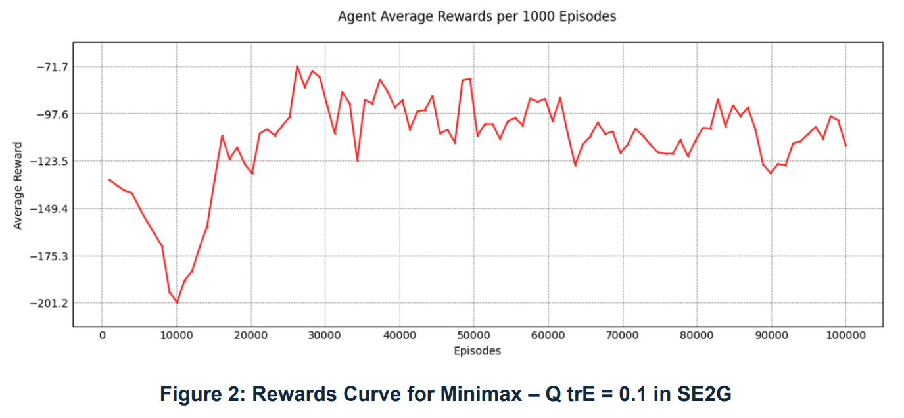

In the implementation of **Minimax-Q trE=0.05**, we observe more impressive results. Initially, the average reward over every 1,000 episodes is higher. The reduced randomness (lower epsilon) significantly helped in selecting better moves, leading to the logical outcome of increased average rewards. Additionally, we see less variance in the graph values after 30,000 episodes. In other words, the **Minimax-Q trE=0.05** implementation achieves greater "stability" in terms of both the number of moves and average rewards.

The results. Let's compare the rate at which goals were scored for the **Minimax-Q trE=0.1** and **Minimax-Q trE=0.05** implementations using difference graphs.

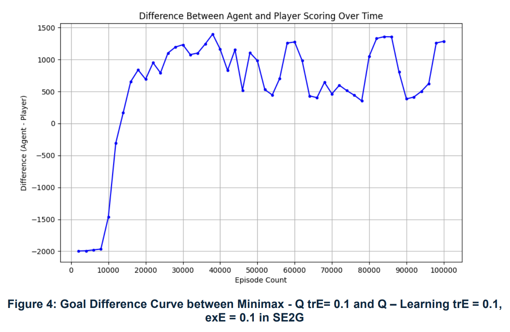

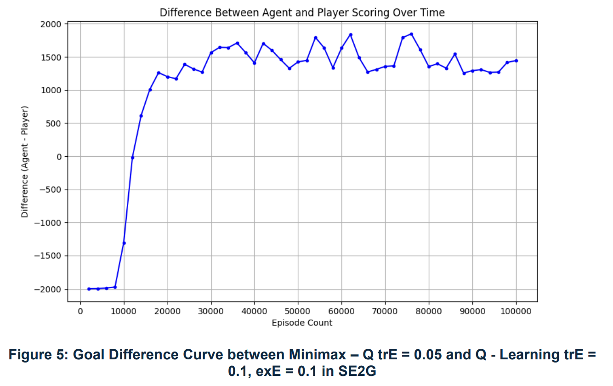

The graphs show the difference $`Goal_{minimax-q} - Goal_{q-learning}`$ every 2,000 episodes. For example, in the first batch of 2,000 episodes, we see a value of -2000 for both **Minimax-Q trE=0.1** and **Minimax-Q trE=0.05**. This means all goals were scored by the **Q-Learning trE=0.1, exE=0.1** policy, up to a score of $`0 - 2000`$.

For the next batches of episodes, up until around episode 8,000, we see that the **Minimax-Q** policy was not yet able to defeat the **Q-Learning** policy. However, around episode 10,000, it began discovering some strategies that allowed it to strategically defeat the opponent. By about episode 20,000, **Minimax-Q** reaches a solid point where its strategies can consistently defeat the opponent.

Once again, we notice the difference in variance between the **Minimax-Q trE=0.1** and **Minimax-Q trE=0.05** implementations. The **Minimax-Q trE=0.05** implementation, with its lower randomness, not only achieves better score differences per batch of episodes but also exhibits greater stability over time.

This reduced variability means that the **trE=0.05** implementation is more consistent in its ability to maintain superior performance, reflecting the positive impact of lower randomness during the training phase. As a result, it not only finds better strategies but also applies them more reliably compared to the higher randomness configuration of **trE=0.1**.

4.1.3 **Belief – Q**

Both the rewards and implementations of **Belief-Q** are identical to those mentioned for the **Minimax-Q** algorithm in the SE2G environment. It is important to note that in the **Belief-Q** implementations, the agent receives beliefs and updates its belief base after every move made by its opponent. The training sessions for these implementations were conducted against **Q-Learning trE=0.1**, similar to **Minimax-Q**, without training the Player. The training lasted up to **100,000 episodes**. According to the naming conventions, the two implementations of **Belief-Q** are named as follows:

1. "SE2GBQ trE=0.1" or "Belief-Q trE=0.1"
2. "SE2GBQ trE=0.05" or "Belief-Q trE=0.05"

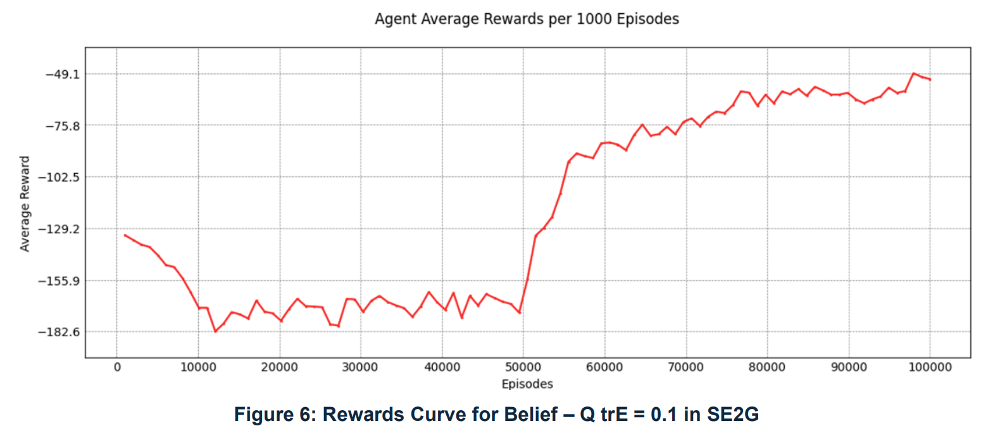

**Belief-Q** appears to perform well in its objective of maximizing rewards based on the opponent’s moves, according to the beliefs it forms about the opponent's behavior. However, it takes significantly longer to discover strategies that work against **Q-Learning** compared to **Minimax-Q**. Despite this delay, we observe less variance in performance compared to **Minimax-Q**. In fact, the moves improve steadily until the end of the training period.

However, this does not necessarily translate to scoring more goals:

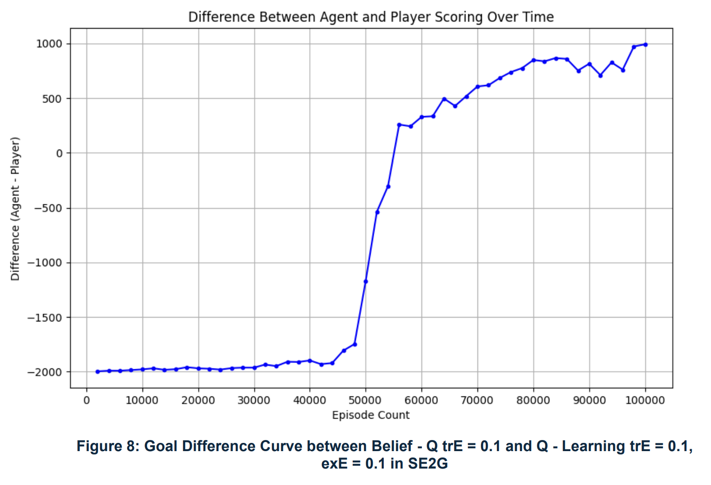

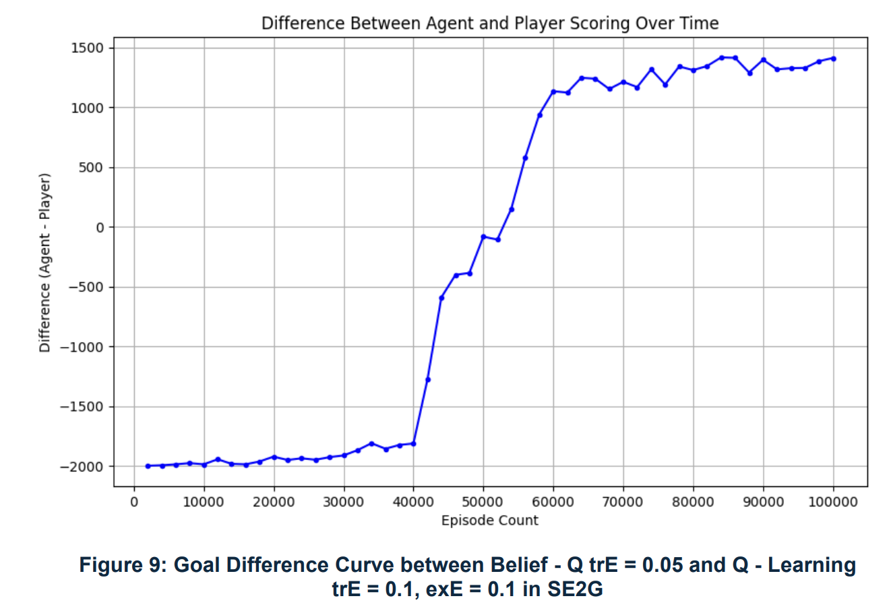

After **100,000 episodes** of training, the difference in the number of goals scored by **Belief-Q** is slightly lower than that of **Minimax-Q** (particularly in the **Belief-Q trE=0.1** implementation). It is possible that with further training, the algorithm could improve even more, as the trend of increasing rewards continues until the end of training. The differences between the **Belief-Q trE=0.1** and **Belief-Q trE=0.05** implementations are similar to those observed in **Minimax-Q**.

4.1.1 **Evaluation of Results in SE6G**

Assuming that all implementations are trained, we can see how well they perform after games lasting **5,000 episodes**.

**Table 1: Results of Opposing Algorithms in SE2G**

| Agent                           | Score            | Player                            |
|---------------------------------|------------------|-----------------------------------|
| **Minimax-Q** trE=0.1, exE=0.1  | 3258 – 1742 (65.16%) | **Q-Learning** trE=0.1, exE=0.1   |
| **Minimax-Q** trE=0.1, exE=0.05 | 3198 – 1802 (63.96%) | **Q-Learning** trE=0.1, exE=0.05  |
| **Minimax-Q** trE=0.05, exE=0.1 | 3331 – 1669 (66.62%) | **Q-Learning** trE=0.1, exE=0.1   |
| **Minimax-Q** trE=0.05, exE=0.05| 3346 – 1654 (66.92%) | **Q-Learning** trE=0.1, exE=0.05  |
| **Belief-Q** trE=0.1, exE=0.1   | 3637 – 1362 (72.74%) | **Q-Learning** trE=0.1, exE=0.1   |
| **Belief-Q** trE=0.1, exE=0.05  | 3685 – 1314 (73.7%)  | **Q-Learning** trE=0.1, exE=0.05  |
| **Belief-Q** trE=0.05, exE=0.1  | 3178 – 1822 (63.56%) | **Q-Learning** trE=0.1, exE=0.1   |
| **Belief-Q** trE=0.05, exE=0.05 | 3313 – 1687 (66.26%) | **Q-Learning** trE=0.1, exE=0.05  |

\*trE: training epsilon after 10k episodes (starting from 1.0)  
\*exE: execution epsilon

The percentages in the second column represent the percentages of goals scored by the respective **Agent** algorithm. The best performer is **Belief-Q trE=0.1, exE=0.05** (against **Q-Learning trE=0.1, exE=0.05**). Interestingly, **Belief-Q trE=0.05** is less effective, even against **Q-Learning trE=0.1, exE=0.05**.

On the other hand, we see that **Minimax-Q trE=0.05** implementations perform better than **Minimax-Q trE=0.1** implementations. Therefore, increased randomness benefits **Belief-Q** but does not aid **Minimax-Q**.

**This result makes sense.**  
**Minimax-Q** relies on strategic consistency to form accurate Q-value estimates and find the best strategy to compete against an optimally playing opponent. Randomness can lead to inconsistent action choices, which in turn cause inconsistent updates of Q-values. As a result, the agent may fail to identify the truly optimal strategy.

In contrast, randomness in the decisions of the **Belief-Q** agent can be beneficial because it allows the agent to explore new strategies and update its beliefs more effectively, improving its overall adaptability in uncertain environments. **Belief-Q** thrives on the ability to gather and adapt to new information about the opponent’s strategy, and randomness helps in exploring a broader set of possibilities, leading to more robust belief updates and better performance over time.

# 4.2 The SE6G Environment

4.2.1 **Q-Learning**

The rewards of the SE6G environment for Q-Learning are as follows:

**Agent A receives the following rewards immediately after its actions:**
- -1 if it moved further away from the ball.
- +1 if the distance between the ball and the opponent's goal decreased.
- +100 if it scored a goal in the opponent's goal.
- -100 if it scored a goal in its own goal.
- -10 if it pushed the ball into a corner.
- -5 for any other move.

**Agent A receives the following rewards immediately after Agent B’s actions (for the immediately previous state-action pair that occurred):**
- +100 if Agent B scored a goal in their own goal.
- -100 if Agent B scored a goal in Agent A’s goal.

In the SE6G environment, the **Q-Learning** algorithm was implemented with the same parameters as in the SE2G environment up to **80,000 episodes** (So it is called **SE6GQ trE=0.1** or **Q – Learning trE=0.1**):

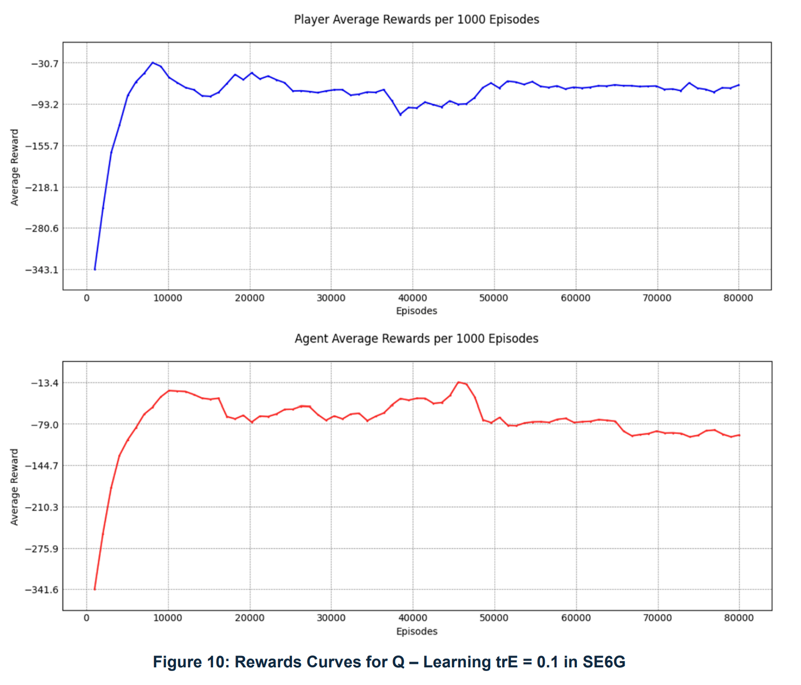

In **Figure 10**, the y'y axis represents the average total rewards of the agents' moves per 1,000 episodes, while the x'x axis, though labeled in steps of 10,000 episodes, actually measures 1,000 episodes per tick.

The curves are very similar, as they represent the implementation of the same algorithm (**Minimax-Q**) in the same environment with identical parameters. After **10,000 episodes**, the rewards stabilize at a reasonable level. We observe that when one agent receives higher rewards, the opponent receives fewer rewards. Compared to the **SE2G** environment, we see less stability in the values but higher overall rewards (which makes sense since we converted corner cells from negative to positive reward cells).

By this point, the agents have developed a good understanding of their environment, and over the last **50,000 episodes**, they refine their strategies further, making scoring a goal an increasingly difficult challenge.

4.2.2 **Minimax – Q**

The rewards in the SE6G environment for **Minimax-Q** are as follows:

**Agent A receives rewards for the transition from state $`s`$ to state $`s'`$:**
- -1 if it moved further away from the ball.
- +1 if the distance between the ball and the opponent's goal decreased.
- +100 if the ball is in the opponent's goal.
- -100 if the ball is in its own goal.
- -10 if the ball was pushed into a corner.
- -5 for any other move.

Two implementations of the **Minimax – Q** algorithm were made in the **SE6G** environment with the same parameters used in the **SE2G** environment. The names of the implementations are therefore:
1. "SE6GMQ trE=0.1" or "Minimax – Q trE=0.1"
2. "SE6GMQ trE=0.05" or "Minimax – Q trE=0.05"

The **epsilon decay** occurred until **10,000 episodes** for both implementations:
- In **Minimax-Q trE=0.1**, epsilon decreased to 0.1 and remained constant until the end of training.
- In **Minimax-Q trE=0.05**, epsilon decreased to 0.05 and remained constant as well.

The **alpha decay** followed the same schedule, decreasing from **0.9 to 0.1** over **10,000 episodes** and staying constant thereafter. The training was conducted against a previously trained **Q-Learning trE=0.1, exE=0.1** implementation, and it lasted for **100,000 episodes** for both **Minimax-Q** implementations.

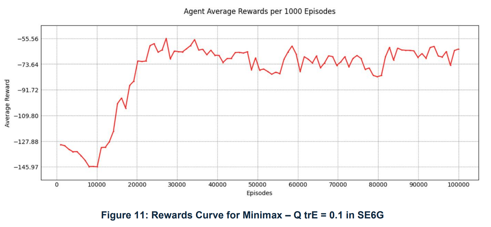

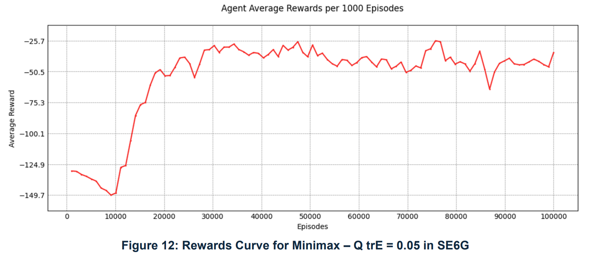

The differences in reward variance between **Minimax-Q trE=0.1** and **Minimax-Q trE=0.05**, which were observed in **SE2G** (as discussed in section 4.1.2), are still present in **SE6G** but are less pronounced. In **Minimax-Q trE=0.05**, higher average rewards are observed compared to **Minimax-Q trE=0.1**, similar to the **SE2G** environment where **SE2GMQ trE=0.05** outperformed **SE2GMQ trE=0.1**.

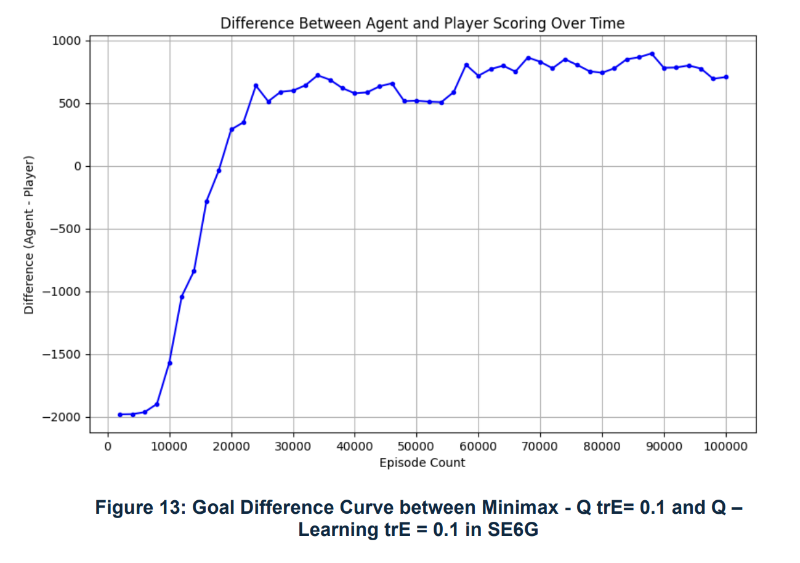

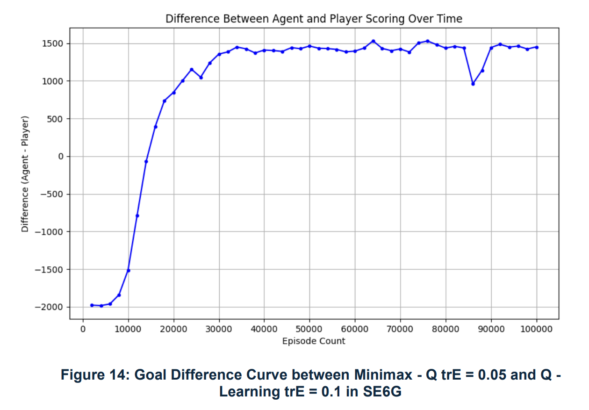

The fluctuations in reward values that were more noticeable in **SE2G** are absent here. The difference in goals scored every 2,000 episodes stabilizes after **58,000 episodes** for **Minimax-Q trE=0.1** and after **30,000 episodes** for **Minimax-Q trE=0.05** (except for an outlier in the **85,000 episode** batch). As expected, lower randomness in **trE=0.05** results in better performance.

4.2.3 **Belief – Q**

Both the rewards and implementations of **Belief – Q** are the same as those mentioned above in the SE2G environment. Therefore the two implementations are called:

1. "SE6GBQ trE=0.1" or "Belief – Q trE=0.1"
2. "SE6GBQ trE=0.05" or "Belief – Q trE=0.05"

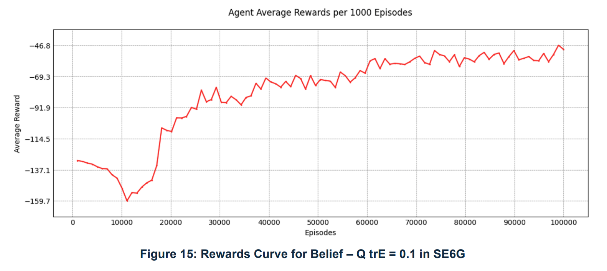

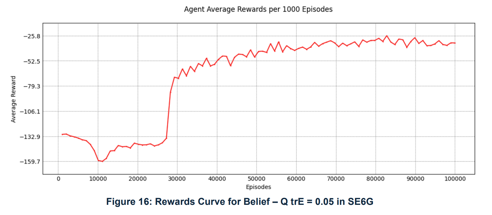

We observe a sharp upward trajectory in performance that continues until the end of training, similar to what was seen in **SE2G**. However, this sharp increase occurs more quickly in **SE6G**. A notable difference is that in the **Belief-Q trE=0.1** implementation (Figure 15), the sharp increase begins at episode **17,000**, whereas in **Belief-Q trE=0.05** (Figure 16), it starts at episode **28,000**, meaning it starts later with lower randomness (smaller epsilon).

Looking back at **SE2G**, the sharp increase in **SE2GBQ trE=0.1** started at episode **50,000** (Figure 6), while in **SE2GBQ trE=0.05**, it started earlier, around episode **42,000** (Figure 7). In other words, the presence of multiple goals in combination with...

lower randomness makes it harder for the agent to discover effective strategies against the opponent. In contrast, in environments with a single goal, discovering strategies becomes easier with reduced randomness.

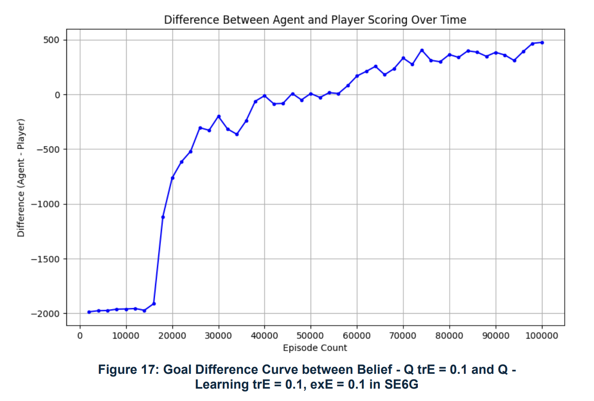

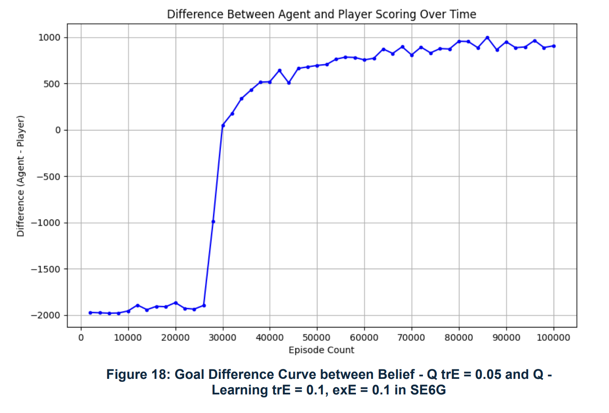

This observation is further supported by the goal difference graphs. Additionally, the values on the y-axis show that in **Belief-Q trE=0.05**, the agent performs twice as well (compared to three times as well in **SE2GBQ trE=0.05**). Another interesting observation is:

Although the average rewards in the **Belief-Q** implementations across the **SE2G** and **SE6G** environments are very similar (see Figures 6, 7, 15, 16), the goal difference values are quite different. In **SE6G**, the algorithm does not manage to score as efficiently as it did in **SE2G**, despite having more opportunities (more goal cells). The maximum values in Figures 17 and 18 are much smaller (by 500 units) than the maximum values in Figures 8 and 9, even though the number of goal cells increased.

4.1.1 **Evaluation of Results in SE6G**

Assuming they are trained, we can see how well they perform after games lasting 5,000 episodes.

**Table 2: Results of Opposing Algorithms in SE6G**

| Agent                           | Score              | Player                           |
|---------------------------------|--------------------|----------------------------------|
| **Minimax-Q** trE=0.1, exE=0.1  | 3538 – 1462 (70.76%) | **Q-Learning** trE=0.1, exE=0.1  |
| **Minimax-Q** trE=0.1, exE=0.05 | 3597 – 1403 (71.94%) | **Q-Learning** trE=0.1, exE=0.05 |
| **Minimax-Q** trE=0.05, exE=0.1 | 3488 – 1512 (69.76%) | **Q-Learning** trE=0.1, exE=0.1  |
| **Minimax-Q** trE=0.05, exE=0.05| 3528 – 1472 (70.56%) | **Q-Learning** trE=0.1, exE=0.05 |
| **Belief-Q** trE=0.1, exE=0.1   | 3281 – 1719 (65.62%) | **Q-Learning** trE=0.1, exE=0.1  |
| **Belief-Q** trE=0.1, exE=0.05  | 3552 – 1448 (70.04%) | **Q-Learning** trE=0.1, exE=0.05 |
| **Belief-Q** trE=0.05, exE=0.1  | 2830 – 2170 (56.6%)  | **Q-Learning** trE=0.1, exE=0.1  |
| **Belief-Q** trE=0.05, exE=0.05 | 3014 – 1986 (60.28%) | **Q-Learning** trE=0.1, exE=0.05 |

\*trE: training epsilon after 10k episodes (starting from 1.0)  
\*exE: execution epsilon

In contrast to the SE2G environment, here we see that **Minimax – Q** is better than **Belief – Q**. The only implementation of **Belief – Q** that is as good as the implementations of **Minimax – Q** is **Belief – Q trE=0.1, exE=0.05** against **Q – Learning trE = 0.1, exE = 0.05**. Therefore between the two algorithms, **Minimax – Q** is better at preventing the opposing agent from passing, while **Belief – Q** is better at scoring goals.

# 4.3 The FE Environment

In the **FE (Full Environment)**, which contains $`122,451`$ states, training was only conducted using the **Q-Learning** algorithm, as it can operate without needing to know the opponent's position in the state representation.

4.3.1 **Q-Learning**

The rewards in the **FE** environment for **Q-Learning** are as follows:

**Agent A receives the following rewards immediately after its actions:**
- -1 if it moved further away from the ball.
- +1 if the distance between the ball and the opponent's goal decreased.
- +100 if it scored a goal in the opponent’s goal.
- -100 if it scored a goal in its own goal.
- -10 if it pushed the ball into a corner.
- -5 for any other move.

Two implementations of the **Q-Learning** algorithm were executed in the **FE** environment with the following parameters:
- Learning rate = 0.1
- Discount Factor = 0.9
- Epsilon:
  1. **Linear decay function** with $`e_{\text{max}} = 1.0`$, $`e_{\text{min}} = 0.1`$, max episodes = $`2,000`$
  2. **Linear decay function** with $`e_{\text{max}} = 1.0`$, $`e_{\text{min}} = 0.05`$, max episodes = $`2,000`$

$`
e_t = \max \left( e_{\text{min}}, e_{\text{max}} - \frac{e_{\text{max}} - e_{\text{min}}}{\text{max episodes}} \cdot t \right)
`$

The epsilon decay occurred over the first **2,000 episodes**, but the training continued until **10,000 episodes**. The training was performed for both agents simultaneously. The implementations are named:

1. "FEQ trE=0.1" or "Q-Learning trE=0.1"
2. "FEQ trE=0.05" or "Q-Learning trE=0.05"

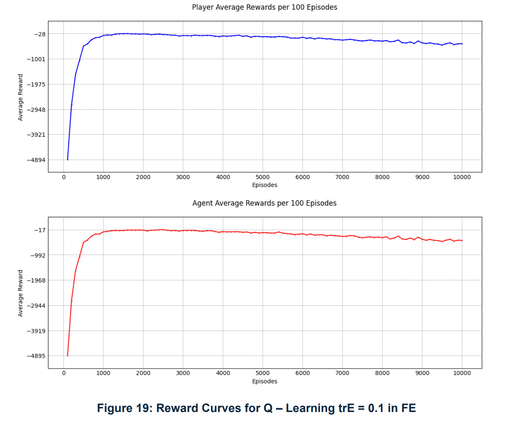

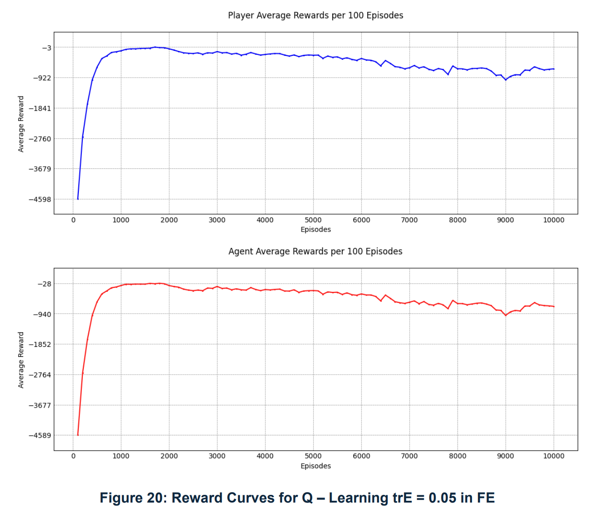

In Figures 19 and 20, the y'y axis represents the average total rewards for the actions in each episode, averaged over every 100 episodes. The x'x axis steps are labeled in increments of 1,000 episodes, but each actual step represents 100 episodes.

The curves have a similar shape because they reflect implementations of the same algorithm (**Q-Learning**) in the same environment with identical parameters. There is a steady decline in the average reward per episode, similar to the pattern observed in **Figure 1**. This decline can be attributed to the increasing difficulty of improving strategies over time, as seen in other implementations.

It's important to note that it is not feasible to implement algorithms in **FE** where rewards are based on the opponent's actions. Both **Q-Learning** implementations in **FE** use a reward function that assigns rewards only for the agent's own actions, not for the opponent's actions. The reason is that the state representation in **FE** does not include the position of the opponent. Therefore, different rewards may be assigned to the same state-action pairs during training. Although the states are technically different due to limited opponent visibility, the lack of opponent position data can result in the same state-action pair being treated differently.

4.1.1 **Evaluation of FE Results via SE2G and SE6G Implementations**

All trained implementations were combined to evaluate their performance over **5,000 episodes** of gameplay post-training. **Table 3** uses a different naming convention, which will be explained later.

| Agent                                    | Score                    | Player                                     |
|------------------------------------------|--------------------------|--------------------------------------------|
| **Q-Learning**                           | **3726 – 1274 (74.52%)**  | **Q-Learning [FEQ] trE=0.1/exE=0.1**       |
| [SE2G, SE6G+FEQ, 93.17%] trE=0.1/exE=0.1  |                          |                                            |
| **Q-Learning**                           | **3426 – 1574 (68.52%)**  | **Q-Learning [FEQ] trE=0.05/exE=0.1**      |
| [SE2G, SE6G+FEQ, 95.01%] trE=0.1/exE=0.1  |                          |                                            |
| **Minimax-Q**                            | **2033 – 2967 (40.66%)**  | **Q-Learning [FEQ] trE=0.1/exE=0.1**       |
| [SE2G, SE6G+FEQ, 83.50%] trE=0.1/exE=0.1  |                          |                                            |
| **Minimax-Q**                            | **4253 – 747 (85.06%)**   | **Q-Learning [SE2G, SE6G+FEQ, 93.35%]**    |
| [SE2G, SE6G+FEQ, 85.85%] trE=0.1/exE=0.1  |                          | trE=0.1/exE=0.1                             |
| **Minimax-Q**                            | **4475 – 525 (89.5%)**    | **Q-Learning [SE2G, SE6G+FEQ, 96.04%]**    |
| [SE2G, SE6G+FEQ, 85.85%] trE=0.1/exE=0.05 |                          | trE=0.1/exE=0.05                            |
| **Minimax-Q**                            | **4282 – 718 (85.64%)**   | **Q-Learning [SE2G, SE6G+FEQ, 92.83%]**    |
| [SE2G, SE6G+FEQ, 87.48%] trE=0.05/exE=0.1 |                          | trE=0.1/exE=0.1                             |
| **Minimax-Q**                            | **4428 – 572 (88.56%)**   | **Q-Learning [SE2G, SE6G+FEQ, 95.85%]**    |
| [SE2G, SE6G+FEQ, 89.70%] trE=0.05/exE=0.05|                          | trE=0.1/exE=0.05                            |
| **Belief-Q**                             | **441 – 4559 (8.82%)**    | **Q-Learning [FEQ] trE=0.1/exE=0.1**       |
| [SE2G, SE6G+FEQ, 88.97%] trE=0.1/exE=0.1  |                          |                                            |
| **Belief-Q**                             | **3260 – 1730 (65.2%)**   | **Q-Learning [SE2G, SE6G+FEQ, 86.75%]**    |
| [SE2G, SE6G+FEQ, 84.94%] trE=0.1/exE=0.1  |                          | trE=0.1/exE=0.1                             |
| **Belief-Q**                             | **3377 – 1623 (66.74%)**  | **Q-Learning [SE2G, SE6G+FEQ, 87.84%]**    |
| [SE2G, SE6G+FEQ, 86.44%] trE=0.1/exE=0.05 |                          | trE=0.1/exE=0.05                            |
| **Belief-Q**                             | **2648 – 2352 (52.96%)**  | **Q-Learning [SE2G, SE6G+FEQ, 85.17%]**    |
| [SE2G, SE6G+FEQ, 82.79%] trE=0.05/exE=0.1 |                          | trE=0.1/exE=0.1                             |
| **Belief-Q**                             | **2751 – 2249 (55.02%)**  | **Q-Learning [SE2G, SE6G+FEQ, 88.12%]**    |
| [SE2G, SE6G+FEQ, 86.57%] trE=0.05/exE=0.05|                          | trE=0.05/exE=0.05                           |

*trE*: training epsilon after X amount of episodes (starting from 1.0)  
*exE*: execution epsilon

By combining the SE2G and SE6G environments, we can derive representative policies for all algorithms in the full environment (FE). However, some states that were not encountered during training in the smaller environments may appear in the full environment. For all such cases, we use the FEQ trE=0.1, exE=0.1 implementation. In the table, each algorithm lists the policies used and the corresponding percentages.

**Naming Convention Example:**
In the first row of Table 3, the Agent used Q-Learning policies with $e_{\text{min}} = 0.1$ during training in both SE2G and SE6G environments and with a constant $e = 0.1$ during the 5,000 post-training episodes. Therefore, it utilized the implementations SE2GQ trE=0.1, exE=0.1 and SE6GQ trE=0.1, exE=0.1 for 93.17% of its actions. The remaining 6.83% of the actions came from the Q-Learning implementation in FE with $e_{\text{min}} = 0.1$ during training and a constant $e = 0.1$ during the 5,000 episodes (using the implementation FEQ trE=0.1, exE=0.1).

It is clear that **Q-Learning** agents trained with visibility of their opponent (i.e., when the opponent's position is included in the state representation) can decisively outperform **Q-Learning** agents that were trained without seeing the opponent. Additionally, both **Minimax-Q** and **Belief-Q** can easily defeat **Q-Learning** agents that trained with the opponent's position in their state representation. However, problems arise when **Minimax-Q** and **Belief-Q** face off against a **Q-Learning** agent that was trained *without* seeing the opponent. This is a crucial observation, and it makes sense for the following reasons:

1. **Minimax-Q**:
   - Minimax-Q is specifically trained against **Q-Learning** agents that could see the opponent during training. Therefore, the strategies it develops are effective only against such agents.
   - When faced with a **Q-Learning** agent that cannot see the opponent, Minimax-Q struggles because this unseen opponent behaves differently. Consequently, strategies that worked during training may fail against this new type of opponent, even if this opponent is technically weaker.

2. **Belief-Q**:
   - Belief-Q develops strategies based on a belief system that is built from the behavior of a specific type of opponent (one that can see and react to the opponent’s position).
   - If it encounters an opponent (like **Q-Learning** without opponent visibility) that behaves differently, its belief base may become less effective. The strategies built on those beliefs are tailored to the expected behaviors of the opponent it trained against, not the new, unseen one.

The **Minimax-Q trE=0.1, exE=0.05** implementation achieves the best success rate against **Q-Learning trE=0.1, exE=0.05** that could see its opponent. The success of Minimax-Q here stems from its ability, developed during training in the SE6G environment, to prevent the opponent from bypassing it easily. This defensive skill is well-suited to challenging environments where the opponent’s moves must be anticipated and countered.

Through testing these algorithms in the **FE** environment, we can also uncover specific behavioral differences between **Minimax-Q** and **Belief-Q**.

# 4.1 Differences and Comparison of Algorithm Behaviors

The following graphs analyze the differences in behaviors and strategies between the trained **Minimax-Q** and **Belief-Q** implementations. These graphs were created after running the algorithms through **5,000 episodes** of games, the results of which were presented in **Table 3**. Specifically, the executions referenced in **Table 3**, rows 4 and 9, were used for the following comparison:

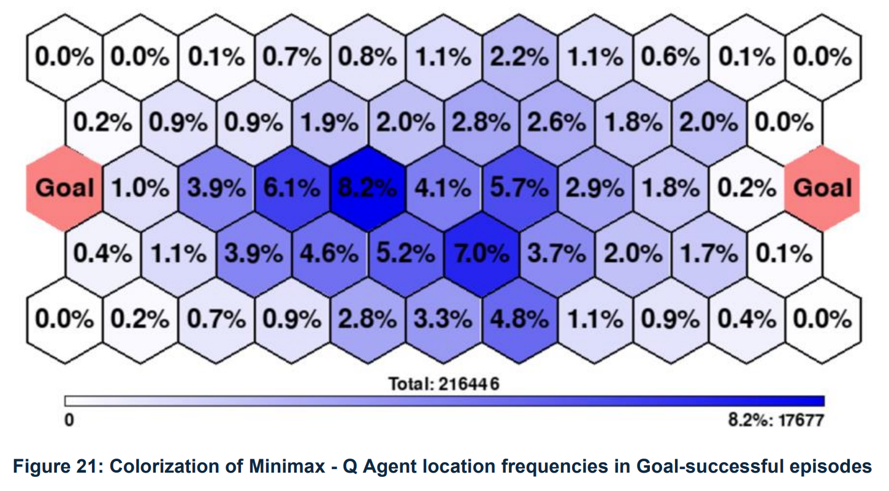

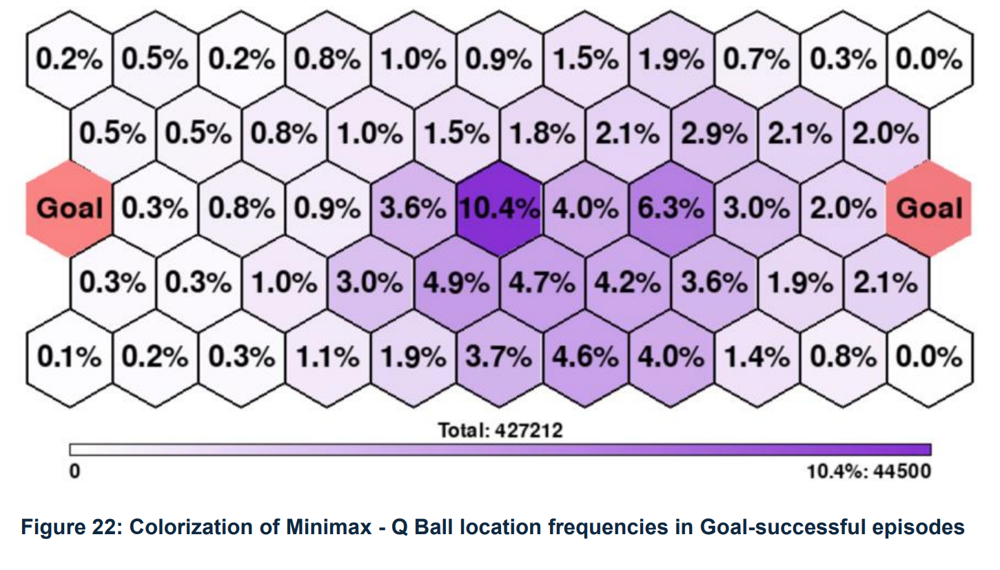

Figures 21 and 22 depict the execution of **SE2GMQ/SE6GMQ/FEQ with trE = 0.1 and exE = 0.1**, against **SE2GQ/SE6GQ/FEQ with the same parameters** (see **Table 3**,row 4), focusing on episodes where **Minimax-Q** managed to score. In **Figure 21**, the frequency of the agent's position in each cell of the environment is presented. The color of each cell corresponds to the percentage of total states in which the agent was located in that specific cell. The percentages displayed within the cells indicate this exact ratio, offering a visual representation of the density of the agent's movements during the episodes that led to goals. Darker colors indicate areas where the agent was found more frequently, while lighter colors indicate areas with less presence of the agent.

**Figure 22** depicts the frequency of the ball’s position in each cell during the same episodes where **Minimax-Q** managed to score. As in **Figure 21**, the color of each cell corresponds to the percentage of total states in which the ball was located in that specific cell. The percentages displayed within the cells show how often the ball was in that position relative to the total number of states.

Darker colors indicate areas where the ball was more concentrated, while lighter colors show areas with less presence of the ball. This figure provides a visual understanding of the ball’s movements during the successful attempts of **Minimax-Q** to score. The density of the ball’s positions around the central area of the field suggests critical action zones that were decisive for scoring goals.

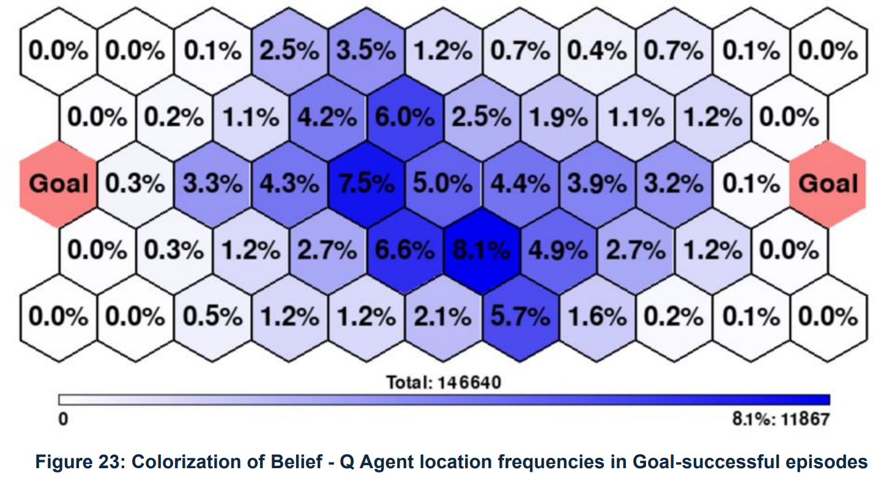

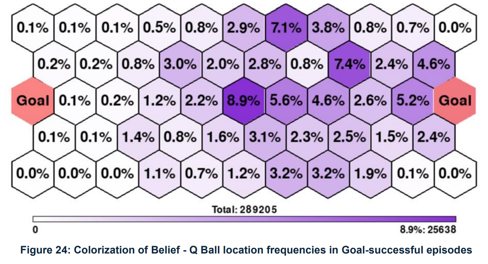

Figures 23 and 24 show the frequency of the agent’s and the ball’s positions, respectively, during episodes where **Belief-Q** managed to score. As in the previous figures, the percentages in the cells indicate the frequency of the agent’s or the ball’s presence in each specific cell. These figures correspond to the execution of **SE2GBQ/SE6GBQ/FEQ trE = 0.1, exE = 0.1**, against **SE2GQ/SE6GQ/FEQ with the same parameters** (see Table 3, row 9).

**Minimax-Q** policies tend to push the ball towards the area near the right goal, mainly using the right side of the field and the area just past the center (Figure 22). **Minimax-Q** policies focus on attacks originating from the right side and the middle of the field, with particular emphasis on bringing the ball close to the opponent's goal through these paths (Figures 21, 22). The defense is more concentrated, mainly protecting the right side and the central area of the field.

**Belief-Q** policies choose to attack mainly from the central area of the field, with the ball often concentrated in positions just past the center and right in front of the opponent’s goal (Figure 23). The defensive strategy is more balanced, covering the entire central area, creating a "wall" that prevents the opponent from advancing the ball (Figure 23).

In Figures 21, 22, 23, and 24, below the grid of each figure, there is a number labeled "Total." This number represents the total number of state transitions that occurred during the episodes being examined. State transitions refer to the changes in the position of the agent, the ball, or the opponent within the field environment as the agent progresses towards its goal, i.e., scoring a goal.

Specifically, **Minimax-Q** policies exhibited **427,212 state transitions** (for the ball frequency analysis, Figure 22), while **Belief-Q** policies exhibited **289,205 transitions** (Figure 24). This means that **Minimax-Q** policies had **1.47 times more state transitions** compared to **Belief-Q** policies.

The larger number of state transitions in **Minimax-Q** policies indicates that agents following this strategy made more moves and position changes to reach their goal, i.e., to score a goal. This may suggest that **Minimax-Q** policies involve a more detailed approach, where each move is significant for achieving the desired result.

In contrast, **Belief-Q** policies, with fewer transitions, appear to be more efficient in terms of the number of moves required to achieve the goal. This may suggest that **Belief-Q** policies are more targeted and effective, allowing agents to reach their goal with fewer position changes and a more direct path.

The difference in state transitions is significant because it reveals aspects of the behavior and efficiency of the strategies followed by the algorithms. A higher number of transitions may indicate greater flexibility but also more complex movements, while a lower number may signal more direct and efficient strategies.

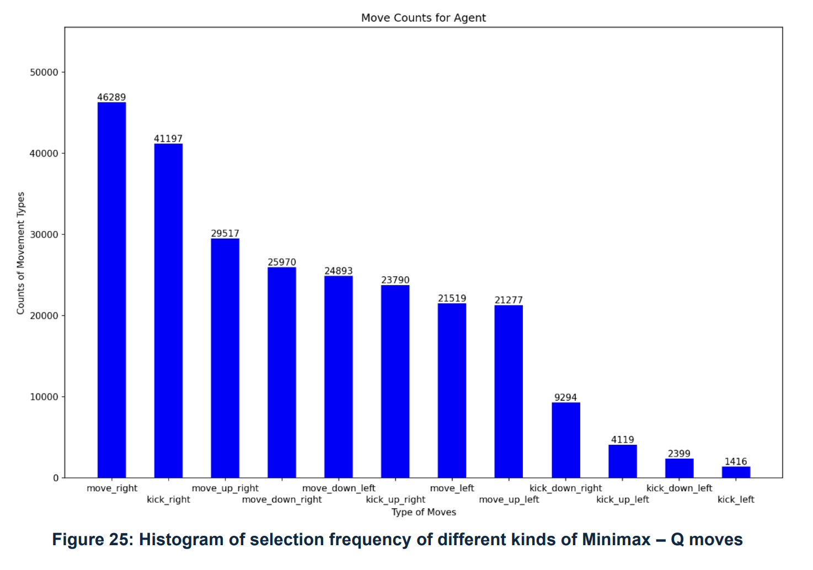

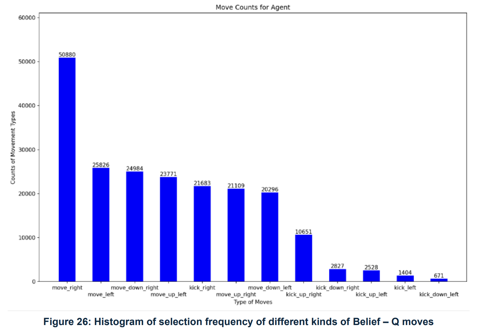

Figures 25 and 26 present histograms showing the frequency of different actions chosen by the policies of Minimax-Q (Figure 25) and Belief-Q (Figure 26). The vertical axis shows the number of times each action was selected, while the horizontal axis shows the different types of actions available to the agents, such as moving in specific directions and kicking the ball in specific directions.

An interesting difference between the policies of the two algorithms is their preference for different types of actions. In Figure 25, it is evident that Minimax-Q policies strongly favor moving to the right and kicking the ball to the right, with the two most frequently selected actions being "move_right" and "kick_right." This preference indicates that Minimax-Q policies focus on an aggressive strategy centered around one direction, trying to push the ball toward the opponent’s goal.

In contrast, Figure 26 shows that Belief-Q policies display greater variety in the actions selected. While "move_right" remains the most frequent action, Belief-Q policies more evenly select movements in various directions, such as "move_left," "move_down_right," and "move_up_left," and less frequently choose to kick the ball to the right. This suggests that Belief-Q policies are more flexible and adapt to a more diverse strategy, possibly to deal with the uncertainty of their opponent more effectively.

The differences in action choices suggest that Minimax-Q policies follow a more rigid strategy primarily based on advancing to the right. On the other hand, Belief-Q policies seem to adopt a more balanced and adaptive approach, allowing them to explore more directions and respond more dynamically to the opponent’s movements. This flexibility may give them an advantage in environments with greater uncertainty or in situations where the opponent’s strategy is not easily predictable.

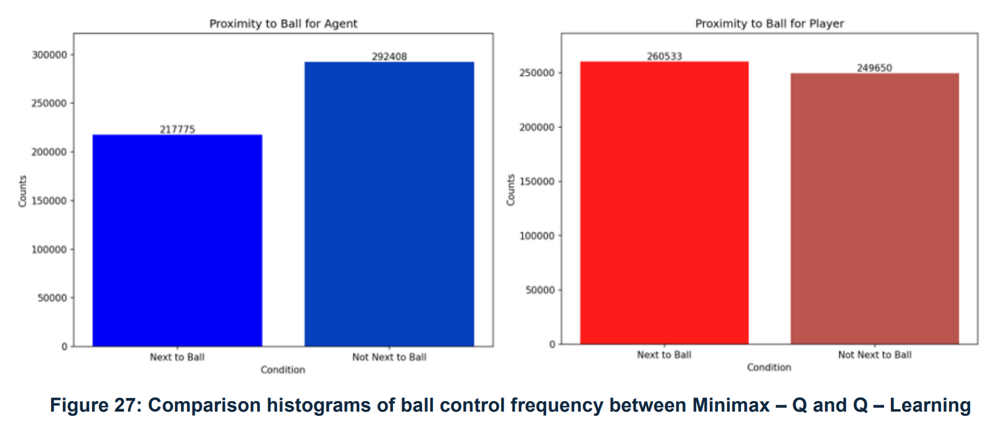

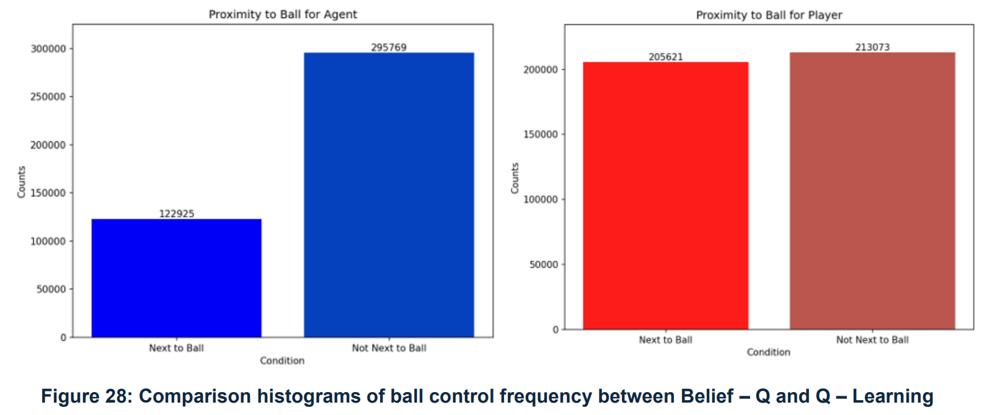

Figures 27 and 28 present histograms comparing the frequency with which the policies of *Minimax-Q* (Figure 27) and *Belief-Q* (Figure 28) choose to be in control of the ball, compared to the opponent using the *Q-Learning* algorithm.

- **Figure 27: Minimax-Q versus Q-Learning**
  - The blue histogram represents the *Minimax-Q* policies, while the red represents the opponent's policies (*Q-Learning*).
  - The left side of each chart shows the number of times the policies choose to be "next to the ball," meaning in a position that allows the agent to control the ball. In contrast, the right side shows the number of times the policies choose not to be "next to the ball."

- **Figure 28: Belief-Q versus Q-Learning**
  - The blue histogram represents the *Belief-Q* policies, while the red represents the opponent's policies (*Q-Learning*).
  - As in Figure 27, the left side of each chart shows the frequency of "next to the ball," and the right side shows the frequency of "not next to the ball."

From the analysis of the figures, it becomes clear that both strategies (*Minimax-Q* and *Belief-Q*) tend to avoid frequent contact with the ball, in contrast to the opponent (*Q-Learning*), who chooses a more balanced presence in both ball control and non-ball control situations. Specifically:

- **Minimax-Q (Figure 27):** The *Minimax-Q* policies show a clear preference for yielding control of the ball to the opponent, as shown by the higher blue histogram on the right (Not Next to Ball). The opponent (*Q-Learning*) is more balanced between the two states, although it also prefers to some extent not to be next to the ball.

- **Belief-Q (Figure 28):** The *Belief-Q* policies exhibit a similar behavior to *Minimax-Q*, but even more pronounced. *Belief-Q* avoids direct contact with the ball even more, leaving it to the opponent (*Q-Learning*), who again chooses a more balanced approach.

These results suggest that the *Minimax-Q* and *Belief-Q* policies likely choose to concede control of the ball to the opponent, preferring to focus on strategic moves that may pay off in future phases of the game. These strategies may involve actions that improve their defensive positioning or preparation for a counter-attack following the opponent’s expected move.

# 5. CONCLUSION

This study focused on the analysis and comparison of three reinforcement learning algorithms: **Q-Learning**, **Minimax-Q**, and **Belief-Q**, within a complex and competitive soccer simulation environment. The experiments conducted highlighted the differences in the performance of the algorithms when trained in environments of varying complexity and strategy. While **Q-Learning** was effective in simpler scenarios, it significantly lagged behind **Minimax-Q** and **Belief-Q**, especially in situations where the estimation and prediction of the opponent’s actions played a crucial role.

Training the algorithms in sub-environments, (**SE2G** and **SE6G**), proved to be crucial for developing effective strategies in the full environment (**FE**). The **Minimax-Q** and **Belief-Q** algorithms developed abilities that allowed them to outperform **Q-Learning**, leveraging their ability to consider the opponent’s reactions and adjust their strategies accordingly. Notably, **Minimax-Q** excelled in its ability to develop defensive strategies that minimized the opponent’s success, while **Belief-Q** demonstrated greater adaptability, although it took longer to develop effective strategies compared to **Minimax-Q**.

In conclusion, this research highlights the superiority of **Minimax-Q** and **Belief-Q** algorithms over **Q-Learning** in competitive environments, mainly due to their ability to predict and respond to the strategies of their opponents. However, their performance significantly depends on their training in representative and well-designed environments. This knowledge can be used to create improved algorithms suitable for applications that require strategic intelligence and adaptability in dynamic conditions.

# ABBREVIATIONS - ARCHIVES - ACRONYMS

| Abbreviation | Description                                    |
|--------------|------------------------------------------------|
| RL           | Reinforcement Learning                         |
| MDPs         | Markov Decision Processes                      |
| FE           | Full Environment                               |
| SE2G         | Small Environment with 2 Goals                 |
| SE6G         | Small Environment with 6 Goals                 |
| trE          | Training Epsilon                               |
| exE          | Execution Epsilon                              |
| FEQ          | Full Environment Q – Learning Implementation   |
| SE2GQ        | SE2G Environment Q – Learning Implementation   |
| SE2GMQ       | SE2G Environment Minimax – Q Implementation    |
| SE2GBQ       | SE2G Environment Belief – Q Implementation     |
| SE6GQ        | SE6G Environment Q – Learning Implementation   |
| SE6GMQ       | SE6G Environment Minimax – Q Implementation    |
| SE6GBQ       | SE6G Environment Belief – Q Implementation     |

# BIBLIOGRAPHY

[1] M. L. Puterman, *Markov Decision Processes: Discrete Stochastic Dynamic Programming*, 2nd Edition, Hoboken, NJ: Wiley, 1994.

[2] W. C. "Markov decision process," 2024. Available: https://wikipedia.org/wiki/Markov_decision_process.

[3] U. Berkley, *SP14 CS188 Lecture 9 -- MDPs II*, 2018.

[4] M. Veloso and W. Uther, "Adversarial Reinforcement Learning," January 2003.

[5] C. J. C. H. Watkins and P. Dayan, "Q-learning," *Machine Learning*, vol. 8, no. 3, pp. 279-292, 1992.

[6] M. L. Littman, "Markov games as a framework for multi-agent reinforcement learning," *Machine Learning*, pp. 157-163, 1994.

[7] Y. Shoham and K. Leyton-Brown, *MULTIAGENT SYSTEMS: Algorithmic, Game-Theoretic, and Logical Foundations*, Revision 1.1 επμ., Cambridge University Press, 2009.

# Disclaimer

The files `minimaxQ.py` and `beliefQ.py` are not included in this repository. If you are interested in accessing these specific implementations, please contact me directly. All other code related to this project is already uploaded and available in this GitHub repository.

